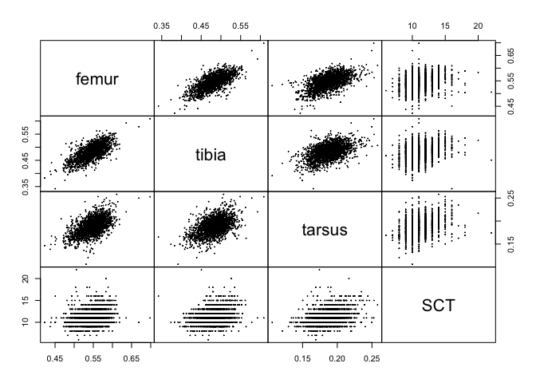
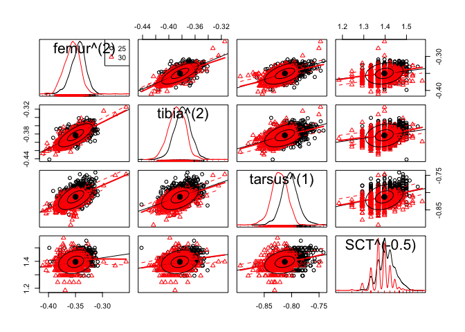
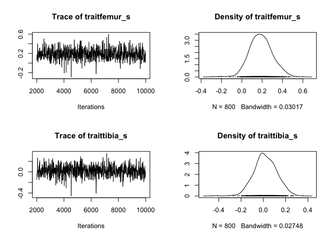
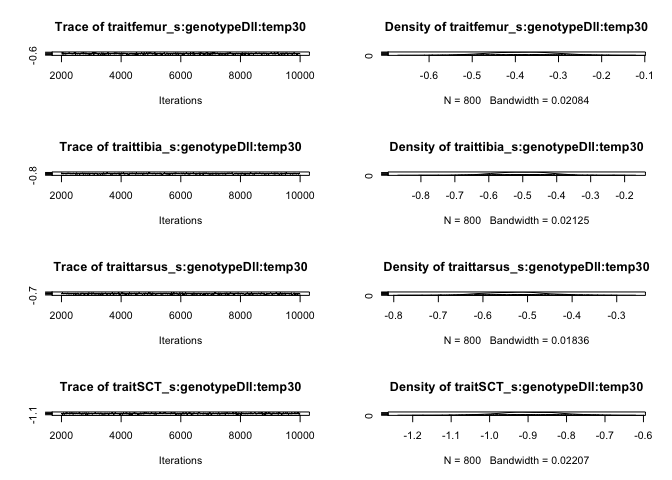
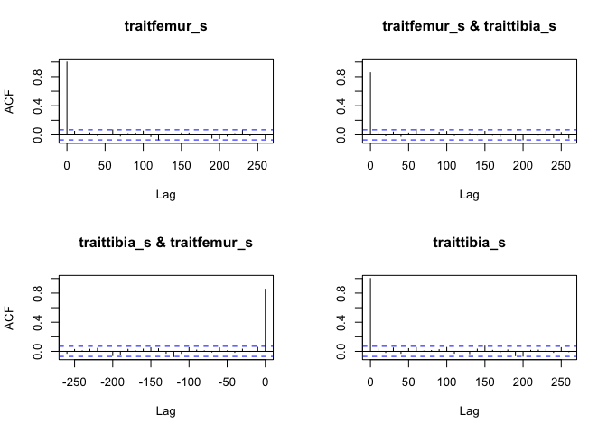
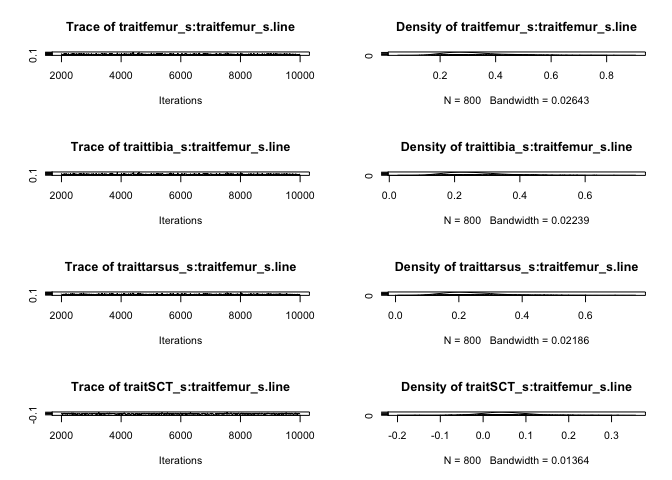
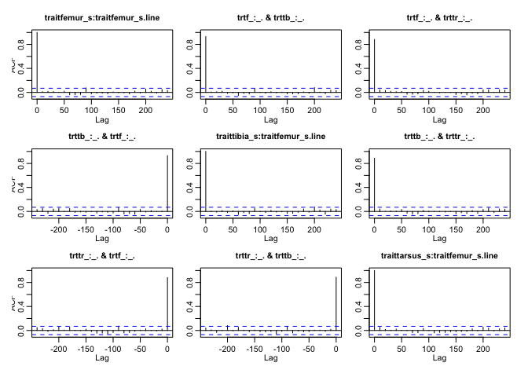

# VerySimpleIntroductionToMultivariateLinearModels
Ian Dworkin  
March 17, 2017  


In todays class we are introducing how to model data when you have multiple continuous response variables. This can be done with a relatively simple extension of the linear models you learned previously (regression, ANOVA, ANCOVA style models).


## Libraries

You may also need to install the following libraries. If you do not have them remove the '#' to uncomment the lines.


```r
# install.packages("car")
# install.packages("geomorph")
library(car)
library(geomorph)
```

```
## Loading required package: rgl
```

```
## Loading required package: ape
```

```r
library(MCMCglmm)
```

```
## Loading required package: Matrix
```

```
## Loading required package: coda
```

the `car` library has some useful functions for helping to make inferences for [multivariate linear models](https://journal.r-project.org/archive/2013-1/fox-friendly-weisberg.pdf). the `geomorph` library is a specialized library for biological shape analysis (geometric morphometrics), but since this data is inherinently multidimensional, there are many useful functions. Check the [wiki](https://github.com/geomorphR/geomorph/wiki) out. Other useful libraries include the [vegan](https://cran.r-project.org/web/packages/vegan/vegan.pdf), including the distance based multivariate analysis of variance using the `adonis` function in it. geomorph's linear model is a refinement of this.

It is also worthwhile to check out the [CRAN Task views](https://cran.r-project.org/web/views/Multivariate.html) for multivariate statistics, to get some sense of availability of libraries with different functionality.

## Source in some custom functions.
We are also going to need some custom functions for multivariate analysis. We use these a lot, but we have been bad and not made an R library out of them. They are available on both our github pages [here](https://github.com/DworkinLab/PitchersJEB2014_cricket_wings/blob/master/scripts/CGwing_analyses_final_2014.Rmd). We wrote most of them for a paper analyzing multivariate shape of Drosophila wings across altitudinal and latitudinal gradients. [Check here](http://onlinelibrary.wiley.com/doi/10.1111/j.1558-5646.2012.01774.x/full) for the paper and [here](http://datadryad.org/resource/doi:10.5061/dryad.r43k1) for the full data and scripts. Lots of cool multivariate examples.

* [R script to source](MLM_Dworkin.R)


```r
source("./BIO708_MLM_Dworkin.R")
ls()
```

```
## [1] "ang.vec.abs" "PD"          "shapePRsq"   "shapeRsq"    "ShapeScore"
```

## Data
We will use an old *Drosophila melanogaster* data set from my PhD work. The associated paper can be found [here](http://onlinelibrary.wiley.com/doi/10.1111/j.1525-142X.2005.05010.x/abstract). This was from a study that was meant to test predictions of a model on how mutational and environmental variation can influence the overall structure of phenotypic variation. For this study I measured several traits (lengths) on the first leg as well as the number of sex comb teeth (a structure used to clasp females during copulation) for different wild type strains (line) reared at different developmental temperatures (temp), with and without a mutation that effects proximal-distal axis development in limbs (genotype).


```r
dll_data = read.csv("http://datadryad.org/bitstream/handle/10255/dryad.8377/dll.csv", header=TRUE)
```

Before we go on, how should we look at the data to make sure it imported correctly, and the structure (and other information) about the object we have just created?
 

```r
summary(dll_data)
```

```
##    replicate         line      genotype        temp          femur     
##  Min.   :1.00   line-7 : 132   Dll: 871   Min.   :25.0   Min.   :0.21  
##  1st Qu.:1.00   line-18: 121   wt :1102   1st Qu.:25.0   1st Qu.:0.53  
##  Median :1.00   line-4 : 112              Median :25.0   Median :0.55  
##  Mean   :1.18   line-8 : 110              Mean   :27.4   Mean   :0.55  
##  3rd Qu.:1.00   line-2 : 104              3rd Qu.:30.0   3rd Qu.:0.57  
##  Max.   :2.00   line-11: 100              Max.   :30.0   Max.   :0.70  
##                 (Other):1294                             NA's   :24    
##      tibia          tarsus          SCT      
##  Min.   :0.34   Min.   :0.11   Min.   : 6.0  
##  1st Qu.:0.46   1st Qu.:0.18   1st Qu.:10.0  
##  Median :0.48   Median :0.19   Median :11.0  
##  Mean   :0.48   Mean   :0.19   Mean   :11.2  
##  3rd Qu.:0.50   3rd Qu.:0.20   3rd Qu.:12.0  
##  Max.   :0.61   Max.   :0.26   Max.   :32.0  
##  NA's   :19     NA's   :17     NA's   :25
```

```r
str(dll_data)
```

```
## 'data.frame':	1973 obs. of  8 variables:
##  $ replicate: int  1 1 1 1 1 1 1 1 1 1 ...
##  $ line     : Factor w/ 27 levels "line-1","line-11",..: 1 1 1 1 1 1 1 1 1 1 ...
##  $ genotype : Factor w/ 2 levels "Dll","wt": 1 1 1 1 1 1 1 1 1 1 ...
##  $ temp     : int  25 25 25 25 25 25 25 25 25 25 ...
##  $ femur    : num  0.59 0.55 0.588 0.588 0.596 ...
##  $ tibia    : num  0.499 0.501 0.488 0.515 0.502 ...
##  $ tarsus   : num  0.219 0.214 0.211 0.211 0.207 ...
##  $ SCT      : int  9 13 11 NA 12 14 11 12 10 12 ...
```

```r
dim(dll_data)
```

```
## [1] 1973    8
```

```r
head(dll_data)
```

```
##   replicate   line genotype temp femur tibia tarsus SCT
## 1         1 line-1      Dll   25 0.590 0.499  0.219   9
## 2         1 line-1      Dll   25 0.550 0.501  0.214  13
## 3         1 line-1      Dll   25 0.588 0.488  0.211  11
## 4         1 line-1      Dll   25 0.588 0.515  0.211  NA
## 5         1 line-1      Dll   25 0.596 0.502  0.207  12
## 6         1 line-1      Dll   25 0.577 0.499  0.207  14
```

## Cleaning data
### removing missing data

Sometimes your data set has missing data, i.e. for some reason you could not measure one of your variables on a particular object. How you decide to deal with missing data can be a big topic, but for the moment we are going to assume you want to delete rows that contain missing data. 

First let's check if there is any missing data


```r
anyNA(dll_data)
```

```
## [1] TRUE
```

For the moment we are just going to remove rows containing any missing data


```r
dll_data <- na.omit(dll_data)
dim(dll_data)
```

```
## [1] 1918    8
```

For ease of interpretation, let's also make the wild-type level of genotype (`wt`) the base level.


```r
dll_data$genotype <- relevel(dll_data$genotype, "wt")
levels(dll_data$genotype)
```

```
## [1] "wt"  "Dll"
```

We will also make temperature (`temp`) a factor (it only has two levels so it does not matter that much).


```r
dll_data$temp <- as.factor(dll_data$temp)
```

Our response variables for this study are *femur, tivia, tarsus and SCT*. Let's check out some basic summary stats for them

```r
summary(dll_data)
```

```
##    replicate         line      genotype   temp          femur      
##  Min.   :1.00   line-7 : 127   wt :1077   25:1006   Min.   :0.423  
##  1st Qu.:1.00   line-18: 119   Dll: 841   30: 912   1st Qu.:0.530  
##  Median :1.00   line-4 : 110                        Median :0.549  
##  Mean   :1.18   line-8 : 108                        Mean   :0.546  
##  3rd Qu.:1.00   line-2 : 100                        3rd Qu.:0.565  
##  Max.   :2.00   line-11:  97                        Max.   :0.698  
##                 (Other):1257                                       
##      tibia           tarsus           SCT      
##  Min.   :0.342   Min.   :0.106   Min.   : 6.0  
##  1st Qu.:0.465   1st Qu.:0.175   1st Qu.:10.0  
##  Median :0.484   Median :0.188   Median :11.0  
##  Mean   :0.482   Mean   :0.188   Mean   :11.1  
##  3rd Qu.:0.501   3rd Qu.:0.200   3rd Qu.:12.0  
##  Max.   :0.609   Max.   :0.258   Max.   :22.0  
## 
```

```r
apply(dll_data[,5:8], 2, sd)
```

```
##  femur  tibia tarsus    SCT 
## 0.0279 0.0280 0.0179 1.6270
```

```r
apply(dll_data[,5:8], 2, mean)
```

```
##  femur  tibia tarsus    SCT 
##  0.546  0.482  0.188 11.132
```

While the three length measurements are on approximately the same scale (and all measured in mm), SCT is count data. So we will probably want to scale each of these to help make comparisons a bit clearer. Before we do that though. Let's ask how these variables co-vary with one another (across the whole data set). In general we prefer working with the variances and covariances, but it is easier to interpret the correlations among variables. We can easily look at both.

For the phenotypic variance-covariance matrix.

```r
cov(dll_data[ ,5:8])
```

```
##           femur    tibia   tarsus     SCT
## femur  0.000781 0.000557 0.000285 0.00935
## tibia  0.000557 0.000785 0.000249 0.01080
## tarsus 0.000285 0.000249 0.000319 0.00860
## SCT    0.009349 0.010796 0.008597 2.64703
```
With the variances for each trait along the diagonal, and the covariances along the off-diagonal. Also note that the covariance of two traits (x and y) is the same in both directions. i.e. cov(x,y) = cov(y,x).

For the phenotypic correlation matrix

```r
cor(dll_data[, 5:8])
```

```
##        femur tibia tarsus   SCT
## femur  1.000 0.712  0.571 0.206
## tibia  0.712 1.000  0.497 0.237
## tarsus 0.571 0.497  1.000 0.296
## SCT    0.206 0.237  0.296 1.000
```

### Let's visualize this as well.

```r
pairs(dll_data[, 5:8], 
      pch = 20, cex = 0.2, gap = 0)
```

<!-- -->

We could do some more plotting to take a look (from the car package). However, there is so much overlap in the data among treatment variables, that it can be hard to see what is going on

```r
scatterplotMatrix( ~ femur + tibia + tarsus + SCT | temp, 
                   ellipse = T, data = dll_data,
                   transform = T)
```

<!-- -->
Not surprising since we have three length measures, but we see a moderate degree of correlation among these traits, likely reflecting a common factor (overall size). However, they are certainly not perfectly correlated with one another. 

In general, when we are dealing with a set of multivariate response variables, this is the situation we want to be in. That is, if there is some correlation between our variables, it is not too high. If it was, I would probably consider using Principal Components Analysis or another dimensional reduction technique to get a few axes of variation that account for most of the variation. We could also check to see if the covariance matrix was not of full rank (i.e. for a covariance matrix for 4 variables, do we really have 4 "independent axes"). One quick check (which directly relates to PCA) is to examine the eigenvalues of the covariance matrix, and make sure the final ones are not really small.

We can extract the eigenvalues.

```r
svd(cov(dll_data[, 5:8]))$d
```

```
## [1] 2.647138 0.001366 0.000239 0.000175
```

The final eigenvalue is not vanishingly small (which is all we need to worry about for the moment).


## Should we scale the response variables.

Like I mentioned earlier, we need to consider whether we should put all response variables on a common scale. This certainly can aid in comparisons with our vector of coefficients. However, if all of your data is already on a pretty similar scale, it may not matter much. In this case, because of SCT I think it is probably worthwhile. 

For length measures it is common to instead to just log transform variables. This is something that can be helpful (but unnecessary with the current data). However, I will scale them here so you can get a sense of it. 


```r
dll_data$femur_s <- scale(dll_data$femur)
dll_data$tibia_s <- scale(dll_data$tibia)
dll_data$tarsus_s <- scale(dll_data$tarsus)
dll_data$SCT_s <- scale(dll_data$SCT)
```

The variables now all have a mean of zero and a standard deviation of 1.


```r
apply(dll_data[,9:12], 2, sd)
```

```
##  femur_s  tibia_s tarsus_s    SCT_s 
##        1        1        1        1
```

```r
apply(dll_data[,9:12], 2, mean)
```

```
##  femur_s  tibia_s tarsus_s    SCT_s 
## 2.95e-16 9.07e-16 1.19e-16 4.51e-16
```

And our co-variance matrix and correlation matrix should be the same.


```r
cov(dll_data[,9:12])
```

```
##          femur_s tibia_s tarsus_s SCT_s
## femur_s    1.000   0.712    0.571 0.206
## tibia_s    0.712   1.000    0.497 0.237
## tarsus_s   0.571   0.497    1.000 0.296
## SCT_s      0.206   0.237    0.296 1.000
```

```r
cor(dll_data[,9:12])
```

```
##          femur_s tibia_s tarsus_s SCT_s
## femur_s    1.000   0.712    0.571 0.206
## tibia_s    0.712   1.000    0.497 0.237
## tarsus_s   0.571   0.497    1.000 0.296
## SCT_s      0.206   0.237    0.296 1.000
```

## Multivariate linear models, let's begin.

The multivariate general linear model is:

$$ 
\mathbf{Y} = \mathbf{XB} + \mathbf{E}
$$

Which you may recognize as being very similar to your univariate linear model. Indeed it is fundamentally the same. However instead of each observation having a single value for its response $y_i$ for an individual $i$, we are now in a situation where each individual has a response **vector**, which we denote as $\mathbf{y}_i$. The vector for that observation is shown in bold as a common way to represent a vector of observations. Since you are using `R` you are actually already pretty familiar with this idea. i.e. if we stored ` y <- 1 ` or `y <- c(1,2,3)` we could recall this vector the same way. The same is true in matrix notation.

However, you see that instead of a lowercase bold $\mathbf{y_i}$, I have instead represented this as an uppercase $\mathbf{Y}$. This is matrix notation to denote a matrix of values. In this case it is meant to represent the $( n x m)$ matrix, for the $n$ observations in rows, and the $m$ response variables we have, which in this case is 4 (femur, tibia, tarsus, SCT). It is standard matrix notation to always talk about 2 dimensional matrices in rows by columns.

How about the right hand side of the equation? Our $\mathbf{X}$ is the design matrix (or model matrix). We will come back to that in a second. Our $\mathbf{B}$ matrix is the matrix of regression coefficients from our model. If you were fitting a simple linear regression, you are used to estimating a slope $(\beta)$ for the model $y = \alpha + \beta x + \epsilon$.

Even for a simple multivariate linear model (with only a single quanatitative predictor variable), we will still estimate a coefficient for each response variable (i.e. a vector. As we add more predictors, this generalizes to a matrix of coefficients. Finally the $\mathbf{E}$ is just a generalization of the residual variation unaccounted for by the model. i.e. it is the same idea as $\epsilon$ for a simple linear model, but we have a vector $\mathbf{e_i}$ of residuals for each observation ($i$) instead of a single value.

However, otherwise the same ideas really apply. We use some approach to estimate the slopes. Just like for a single response, the MLE and LS estimators are equivalent under most conditions and can be found with:

$$
\hat{\mathbf{B}} = (\mathbf{X'X})^{-1} \mathbf{X'Y}
$$

Let's give it a whirl. We will start with a really simply model with a single predictor with two levels (genotype). Importantly you do need to let `R` know that your response variables are numeric. Otherwise the call is a standard call to `lm`

```r
mlm_fit1 <- lm(as.matrix(dll_data[,9:12]) ~ genotype, data = dll_data)

class(mlm_fit1)
```

```
## [1] "mlm" "lm"
```

So what do we get from this? Summary does not give us what we want. Instead it provides the linear model for each response variable in turn. So not so helpful.


```r
summary(mlm_fit1)
```

```
## Response femur_s :
## 
## Call:
## lm(formula = femur_s ~ genotype, data = dll_data)
## 
## Residuals:
##    Min     1Q Median     3Q    Max 
## -4.356 -0.610  0.097  0.703  5.500 
## 
## Coefficients:
##             Estimate Std. Error t value Pr(>|t|)    
## (Intercept)  -0.0690     0.0304   -2.27  0.02335 *  
## genotypeDll   0.1573     0.0459    3.43  0.00062 ***
## ---
## Signif. codes:  0 '***' 0.001 '**' 0.01 '*' 0.05 '.' 0.1 ' ' 1
## 
## Residual standard error: 0.997 on 1916 degrees of freedom
## Multiple R-squared:  0.00609,	Adjusted R-squared:  0.00557 
## F-statistic: 11.7 on 1 and 1916 DF,  p-value: 0.000622
## 
## 
## Response tibia_s :
## 
## Call:
## lm(formula = tibia_s ~ genotype, data = dll_data)
## 
## Residuals:
##    Min     1Q Median     3Q    Max 
## -5.246 -0.608  0.058  0.676  4.676 
## 
## Coefficients:
##             Estimate Std. Error t value Pr(>|t|)    
## (Intercept)  -0.1719     0.0299   -5.75    1e-08 ***
## genotypeDll   0.3921     0.0451    8.69   <2e-16 ***
## ---
## Signif. codes:  0 '***' 0.001 '**' 0.01 '*' 0.05 '.' 0.1 ' ' 1
## 
## Residual standard error: 0.981 on 1916 degrees of freedom
## Multiple R-squared:  0.0379,	Adjusted R-squared:  0.0374 
## F-statistic: 75.4 on 1 and 1916 DF,  p-value: <2e-16
## 
## 
## Response tarsus_s :
## 
## Call:
## lm(formula = tarsus_s ~ genotype, data = dll_data)
## 
## Residuals:
##    Min     1Q Median     3Q    Max 
## -4.472 -0.652  0.008  0.634  4.024 
## 
## Coefficients:
##             Estimate Std. Error t value Pr(>|t|)   
## (Intercept)   0.0624     0.0304    2.05    0.040 * 
## genotypeDll  -0.1423     0.0459   -3.10    0.002 **
## ---
## Signif. codes:  0 '***' 0.001 '**' 0.01 '*' 0.05 '.' 0.1 ' ' 1
## 
## Residual standard error: 0.998 on 1916 degrees of freedom
## Multiple R-squared:  0.00499,	Adjusted R-squared:  0.00447 
## F-statistic:  9.6 on 1 and 1916 DF,  p-value: 0.00197
## 
## 
## Response SCT_s :
## 
## Call:
## lm(formula = SCT_s ~ genotype, data = dll_data)
## 
## Residuals:
##    Min     1Q Median     3Q    Max 
## -3.336 -0.555  0.060  0.675  6.499 
## 
## Coefficients:
##             Estimate Std. Error t value Pr(>|t|)    
## (Intercept)  -0.1413     0.0301   -4.70  2.8e-06 ***
## genotypeDll   0.3223     0.0454    7.09  1.8e-12 ***
## ---
## Signif. codes:  0 '***' 0.001 '**' 0.01 '*' 0.05 '.' 0.1 ' ' 1
## 
## Residual standard error: 0.987 on 1916 degrees of freedom
## Multiple R-squared:  0.0256,	Adjusted R-squared:  0.0251 
## F-statistic: 50.3 on 1 and 1916 DF,  p-value: 1.83e-12
```

Instead we need to let R know we want this as a single multivariate linear model.


```r
summary(manova(mlm_fit1))
```

```
##             Df Pillai approx F num Df den Df Pr(>F)    
## genotype     1  0.102       54      4   1913 <2e-16 ***
## Residuals 1916                                         
## ---
## Signif. codes:  0 '***' 0.001 '**' 0.01 '*' 0.05 '.' 0.1 ' ' 1
```

Unfortunately, by default this spits out a minimal amouont of useful information. While the object contains a few additional bits of information that are useful, mostly this is all about getting a p-value. Before we go on to something more useful, let's talk about what is going on with this output.

While we have just estimated a single predictor variable (genotype) you can see we are not using just one degree of freedom, but 4 (num Df). This is because we have 4 response variables that we are estimating. This is the first (and one of the most important) things to keep in mind with a multivariate linear model. We will be estimating a lot more parameters, so we need to keep in mind how much we can estimate in a model. As we will see below, this is why distance based approaches (like in adonis/vegan and geomorph) are often used. 

The other two things to note is this "Pillai" statistic and the approximate F statistic. It turns out that with the matrices that are used for inference ($\mathbf{H}$ the *hypothesis matrix*) in a multivariate test, there are multiple possible test statistics that can be evaluated based on the eigenvalues. Essentially we want to examine the eigenvalues of:

$\mathbf{HE^{-1}}$ where $\mathbf{E}$ is the matrix of residuals. There are four commonly used test statistics that are derived from the eigenvalues of this matrix. I don't want to get into this here, but do check out inferences for [multivariate linear models](https://journal.r-project.org/archive/2013-1/fox-friendly-weisberg.pdf) for more information, and how it is used in `car`.
While this defaults to Pillai's trace, many in biology seem to use Wilks's $\lambda$. Most of the time these give pretty similar results. You can easily change it, like so:


```r
summary(manova(mlm_fit1), test = "Wilks")
```

```
##             Df Wilks approx F num Df den Df Pr(>F)    
## genotype     1 0.899       54      4   1913 <2e-16 ***
## Residuals 1916                                        
## ---
## Signif. codes:  0 '***' 0.001 '**' 0.01 '*' 0.05 '.' 0.1 ' ' 1
```

In each case a test statistic, an approximation of the F statistic and a p-value. It is worth seeing how the `car` package handles this. For the moment this appears the same.


```r
Anova(mlm_fit1)
```

```
## 
## Type II MANOVA Tests: Pillai test statistic
##          Df test stat approx F num Df den Df Pr(>F)    
## genotype  1     0.102       54      4   1913 <2e-16 ***
## ---
## Signif. codes:  0 '***' 0.001 '**' 0.01 '*' 0.05 '.' 0.1 ' ' 1
```

### How about measures of effect size?
What we would like to start to think about is effect size. This is not something that is universally agreed upon in multivariate statistics. However in both morphometrics and genomics it is typical to use the magnitude or *length* of the vector for coefficients associated with the response. This is sometimes known as the *L2 norm* of the vector, but you can mostly easily think about it as the square root of the sum of squares for each coefficient. i.e:

$$
\lVert \mathbf{x} \rVert = \sqrt{\mathbf{x'} \cdot \mathbf{x}}
$$

This is equivalent to:
$$ \lVert \mathbf{x} \rVert = \sqrt{x^{2}_{1} + x^{2}_{2} + \cdots + x^{2}_{n}}
$$

Which you may recognize from the Pythagorean theorem. 

For our model we can examine the coefficients easily

```r
coef(mlm_fit1)
```

```
##             femur_s tibia_s tarsus_s  SCT_s
## (Intercept)  -0.069  -0.172   0.0624 -0.141
## genotypeDll   0.157   0.392  -0.1423  0.322
```

```r
# Length/magnitude (L2 norm) of the vector
sqrt(t(coef(mlm_fit1)[2,]) %*% coef(mlm_fit1)[2,])
```

```
##      [,1]
## [1,] 0.55
```

```r
# or equivalently
sqrt(sum(coef(mlm_fit1)[2,]^2))
```

```
## [1] 0.55
```

However, this gets annoying to write out each time. So one of the functions in the source file does this for you. `PD()` (for Procrustes Distance) computes the Euclidian Distance between two vectors, but also can compute the length of the vector we want.


```r
PD(coef(mlm_fit1)[2,])
```

```
##      [,1]
## [1,] 0.55
```

Unfortunately in many fields of biology intepreting this magnitude of effect can be tricky. I will show you one example from [this paper](http://biorxiv.org/content/early/2014/05/19/005322) to give you some ideas. To make sense of it, and what oour expectations are under the null, we generated permutations of the data and computed the length of those vectors to generate a distribution. In some fields (like geometric morphometrics), this measure is used quite commonly so we have an easier time with biological interpretation and comparison. To generate confidence intervals on this we generally utilize non-parametric bootstrapping. 

When deciding on multivariate measures of effect sizes the two things to keep in mind (as discussed in class) are how many response variables you have, and whether or not you have scaled the variables (both response and predictors) to help enable comparisons.

### Mahalanobis distance
One approach to deal with this is to use a standardized measure. As with other measures of effect size you could consider multiple options. If one of your treatments is a control, perhaps scale the measure by the magnitude/length of the vector for the mean values for the control. However probably the most common approaches is to scale by a measure of variability. If you think about a common univariate measure of effect size like *Cohen's d*:

$$
d = \frac{\bar{x}_t - \bar{x}_c}{\sigma_{pooled}}
$$

Where $\bar{x}_t$ is the estimated (or just mean) treatment mean, $\bar{x}_c$ is the estimated control mean, and \sigma_{pooled} is the pooled standard deviation. 

We can use a multivariate extension of this same approach. As you will see it is essentially the Euclidian distance we examined above but scaled by the pooled variance-covariance matrix, $\mathbf{S}$. The measure is defined as:

$$
D^{2} = (\mathbf{\bar{x}}_t - \mathbf{\bar{x}}_c )' S^{-1} (\mathbf{\bar{x}}_t - \mathbf{\bar{x}}_c)
$$

Where $\mathbf{\bar{x}}_t$ is the mean vector for the treatment,$\mathbf{\bar{x}}_c$ is the mean vector for the control and $S^{-1}$ is the inverse of the pooled phenotypic variance-covariance matrix. Great care should be taken with generating the pooled covariance matrix (as with generating the pooled sd for *Cohen's d*). In particular you should first center observations on their treatment means, and then generate the pooled covariance matrix.

You can probably envision other variants of this (in particular which matrix to use for scaling).

`R` has a function to compute this `mahalanobis`.

## How about coefficient of determination?
We might also like to understand how much variation (of all of the variation) that the model accounts for. As this is multivariate data, there are actually multiple ways of doing this (based on both the trace of the matrix and some based on the determinant). So there is no single $R^2$ measure. However, there is a relatively simple one that we like to employ, recognizing that it does not capture everything. Essentially we take the trace (sum of the elements on the diagonal) of the variance covariance matrix for the observed data as a measure of total variation in the data. We then ask how much of the variation in the trace of the matrix is accounted for by the trace of the fitted values. i.e:

$$
\frac{Tr(\mathbf{V}_{\hat{Y}})}{Tr(\mathbf{V}_{Y})}
$$

Where $Tr(\mathbf{V}_{\hat{Y}})$ is the trace for the matrix of fitted values, and $Tr(\mathbf{V}_{Y})$ is the trace for the observed.

Since we have scaled all of our observations in our response, then we know that the trace needs to be equal to the number of variables we are using in our response (4 in this case). Let's check


```r
sum(diag(cov(dll_data[,9:12])))
```

```
## [1] 4
```

How about for our fitted values?


```r
sum(diag(cov(mlm_fit1$fitted)))
```

```
## [1] 0.0746
```

```r
sum(diag(cov(mlm_fit1$fitted)))/sum(diag(cov(dll_data[,9:12])))
```

```
## [1] 0.0186
```

So we can account for just under 2% of the variation (based on this measure) in all of our response variables, using genotype as the sole predictor.

Once again, the above code is annoying to write, so we have written a nice function for you, `shapeRsq`


```r
shapeRsq(mlm_fit1)
```

```
## [1] 0.0186
```

## Distance based approaches.

Before we get too complicated with our model, I also want to show you a distance based approach, as implemented in geomorph. This is useful because we are computing distances (essentially Euclidian distances) between observations (although not the raw distances, but based on the mean estimates within and between treatment levels). This means we are ultimately estimating far fewer coefficients, so can be very helpful when we have large numbers of response traits relative to number of observations.

They have a number of functions in the geomorph library, but for most needs, I suggest starting with `procD.lm`


```r
mlm_fit2 <- procD.lm(f1 = dll_data[, 9:12] ~ genotype, data = dll_data, iter = 2000 )
```


```r
summary(mlm_fit2)
```

```
## 
## Call:
## procD.lm(f1 = dll_data[, 9:12] ~ genotype, iter = 2000, data = dll_data) 
## 
## 
## 
## 
## Type I (Sequential) Sums of Squares and Cross-products
## Randomized Residual Permutation Procedure Used
## 2001 Permutations
## 
##             Df   SS    MS    Rsq    F    Z Pr(>F)    
## genotype     1  143 142.9 0.0186 36.4 22.9  5e-04 ***
## Residuals 1916 7525   3.9                            
## Total     1917 7668                                  
## ---
## Signif. codes:  0 '***' 0.001 '**' 0.01 '*' 0.05 '.' 0.1 ' ' 1
```

Of note, this allows for several different types of permutation tests, by default based on using the residuals from a reduced model (in this case there is only one.)

Note that it actually provides the same estimated coefficients, as these are typically used to compare Procrustes Distance (Euclidian Distance) as a measure of effect size


```r
coef(mlm_fit2)
```

```
##             femur_s tibia_s tarsus_s  SCT_s
## (Intercept)  -0.069  -0.172   0.0624 -0.141
## genotypeDll   0.157   0.392  -0.1423  0.322
```

The 'advanced.procD.lm()` can do much of this automatically, but it is designed to compare sets of nested models.

## Does the data conform to the assumptions of a multivariate linear model?

As with any other general linear model you want to examine how well the model fit conforms to the assumptions of the GLM. This gets a bit trickier for multivariate data, although it can still be done. The most difficult issue is whether the residuals conform to multivariate normality. While there are a number of tests for this, in almost all cases with reasonable amounts of data, MVN seems to be rejected. Therefore, most researchers use non-parametric resampling (bootstrapping and permutation tests) to aid in the inferences. There are several approaches to this. See both the `adonis()` and the functions in `geomorph` for some examples. On our github page with the code for [this paper](https://github.com/DworkinLab/PitchersJEB2014_cricket_wings/blob/master/scripts/CGwing_analyses_final_2014.Rmd) we have some different approaches. Remember that it gets tricky to do permutation tests for complex models (where you can not just do a simple permutation of response data relative to predictors). Also keep in mind that you want to resample at the levels of observations (rows), not single variables!

## More complicated models.

Let's add some complexity to the model. We have additional predictors, temp (rearing temperature) and line (different wild type strains.)


```r
mlm_fit4 <- lm(as.matrix(dll_data[,9:12]) ~ temp + genotype, data = dll_data)
mlm_fit5 <- lm(as.matrix(dll_data[,9:12]) ~ temp*genotype, data = dll_data)

Anova(mlm_fit5)
```

```
## 
## Type II MANOVA Tests: Pillai test statistic
##               Df test stat approx F num Df den Df Pr(>F)    
## temp           1    0.3077    212.3      4   1911 <2e-16 ***
## genotype       1    0.1042     55.6      4   1911 <2e-16 ***
## temp:genotype  1    0.0761     39.3      4   1911 <2e-16 ***
## ---
## Signif. codes:  0 '***' 0.001 '**' 0.01 '*' 0.05 '.' 0.1 ' ' 1
```


```r
mlm_fit4_dist <- procD.lm(dll_data[,9:12] ~ genotype*temp,
                          data = dll_data, iter = 2000)
```


```r
summary(mlm_fit4_dist)
```

```
## 
## Call:
## procD.lm(f1 = dll_data[, 9:12] ~ genotype * temp, iter = 2000,  
##     data = dll_data) 
## 
## 
## 
## Type I (Sequential) Sums of Squares and Cross-products
## Randomized Residual Permutation Procedure Used
## 2001 Permutations
## 
##                 Df   SS   MS    Rsq     F    Z Pr(>F)    
## genotype         1  143  143 0.0186  44.2 22.9  5e-04 ***
## temp             1 1136 1136 0.1481 351.2 43.8  5e-04 ***
## genotype:temp    1  200  200 0.0260  61.8 32.2  5e-04 ***
## Residuals     1914 6190    3                             
## Total         1917 7668                                  
## ---
## Signif. codes:  0 '***' 0.001 '**' 0.01 '*' 0.05 '.' 0.1 ' ' 1
```

We can look at the lengths of the vectors to get a sense of relative effects of temp, genotype and their interaction.


```r
PD(coef(mlm_fit5)[2,])
```

```
##      [,1]
## [1,] 1.06
```

```r
PD(coef(mlm_fit5)[3,])
```

```
##      [,1]
## [1,] 1.16
```

```r
PD(coef(mlm_fit5)[4,])
```

```
##      [,1]
## [1,]  1.3
```

How about variance accounted for? We have a slightly more advanced version for this. However, with interaction terms, this can be difficult to interpret (and we tend to only use it for main effects).


```r
shapeRsq(mlm_fit4)
```

```
## [1] 0.167
```

```r
shapePRsq(mlm_fit4)
```

```
## $Rsquared
## [1] 0.167
## 
## $partials
##   variable.name        partial.Rsq
## 1          temp  0.150926579344358
## 2      genotype 0.0257889597702598
```

```r
shapePRsq(mlm_fit5)
```

```
## $Rsquared
## [1] 0.193
## 
## $partials
##   variable.name          partial.Rsq
## 1          temp -1.3753888557632e-16
## 2      genotype -2.7507777115264e-16
## 3 temp:genotype   0.0312535650989142
```
As mentioned in class the partial coefficient of determination calculated this way works well for main effects, but can have problems with interactions. Also, because of the potential for correlations (or lack of balance in the data which induced correlations), the partial $R^2$ do not add up to the model total (nor should they).

## How about mixed models

Since line should be fit as a random effect, we need to consider our options. In R the best choice is to then go ahead and use `MCMCglmm` which has a natural interface for general multivariate mixed models.  It takes a while to get used to the interface, but here is an example. Please check out [here](https://cran.r-project.org/web/packages/MCMCglmm/index.html) for more information about the library, and [here](https://cran.r-project.org/web/packages/MCMCglmm/vignettes/Overview.pdf) for an overview of how to use this library.


First I find it easier (given the interface of MCMCglmm) to create a formula with the response variables and predictors. This is only for the fixed effects part of the model.

```r
fmla.MMLM1  <- as.formula(paste("cbind(femur_s, tibia_s, tarsus_s, SCT_s)" ,"~", "trait + trait:genotype + trait:temp + trait:genotype:temp - 1"))

fmla.MMLM1
```

```
## cbind(femur_s, tibia_s, tarsus_s, SCT_s) ~ trait + trait:genotype + 
##     trait:temp + trait:genotype:temp - 1
```
Now we need to let `MCMCglmm` know which family (i.e. distribution) the response variables are. Since all are normal (Gaussian), we can specify it the following way.


```r
fam.test <- rep("gaussian", 4 )
```

Since `MCMCglmm` is fundamentally a Bayesian approach, it needs a prior. If you provide no prior by default, it tries a "flat" prior, although this rarely works. In this case I am providing a relatively flat prior, but just for the random effects of line and for the residual matrix.


```r
prior.model.1 <- list( R=list(V=diag(4)/4, nu=0.004),  
                       G=list(G1=list(V=diag(4)/4, nu=0.004)))
```

Finally we can fit the model. A couple of things of note. the `fmla.MMLM1` is just the formula object we created above. The `trait` term is a reserved word in MCMCglmm, letting it know we want to fit a multivariate mixed model. We need to specify this for both the random effects term (random) and the residual covariances (rcov). the `us(trait):line` asks it to fit an *unstructured* covariance matrix for the line term (i.e the different wild type genotypes we are examining). Unstructured means we are estimating the complete 4 x 4 matrix of covariances (representing the 10 unique elements since the lower diagonal elements are the same as the upper diagonal).

The `nitt` is how many interations for the MCMC we want to perform, and the burnin is how many should be ignored at the beginning of the random walk.


```r
MMLM1.fit <- MCMCglmm(fmla.MMLM1,
                      random=~ us(trait):line, 
                      rcov=~ us(trait):units,
                      prior=  prior.model.1,
                      data= dll_data, 
                      family = fam.test, 
                      nitt= 10000, burnin= 2000, thin=10)
```

```
## 
##                        MCMC iteration = 0
## 
##                        MCMC iteration = 1000
## 
##                        MCMC iteration = 2000
## 
##                        MCMC iteration = 3000
## 
##                        MCMC iteration = 4000
## 
##                        MCMC iteration = 5000
## 
##                        MCMC iteration = 6000
## 
##                        MCMC iteration = 7000
## 
##                        MCMC iteration = 8000
## 
##                        MCMC iteration = 9000
## 
##                        MCMC iteration = 10000
```

Normally we would spend a fair bit of time on diagnostics of the MCMC, but for now we will just take a quick check at the autocorrelation.

Let's take a look at a bit. The "Sol" is for solution, which is the term used for fixed effects in MCMCglmm. VCV is for variance covariance matrix.


```r
plot(MMLM1.fit$Sol[,1:4])
```

<!-- -->

```r
plot(MMLM1.fit$Sol[,13:16])
```

<!-- -->

```r
acf(MMLM1.fit$Sol[,1:2])
```

<!-- -->

```r
plot(MMLM1.fit$VCV[,1:4])
```

<!-- -->

```r
acf(MMLM1.fit$VCV[,1:3])
```

<!-- -->

Nothing terribly worrying.


```r
summary(MMLM1.fit)
```

```
## 
##  Iterations = 2001:9991
##  Thinning interval  = 10
##  Sample size  = 800 
## 
##  DIC: 17052 
## 
##  G-structure:  ~us(trait):line
## 
##                                  post.mean l-95% CI u-95% CI eff.samp
## traitfemur_s:traitfemur_s.line      0.3232  0.16278    0.539      800
## traittibia_s:traitfemur_s.line      0.2635  0.12995    0.451      800
## traittarsus_s:traitfemur_s.line     0.2390  0.08994    0.412      800
## traitSCT_s:traitfemur_s.line        0.0519 -0.06130    0.168      800
## traitfemur_s:traittibia_s.line      0.2635  0.12995    0.451      800
## traittibia_s:traittibia_s.line      0.2780  0.13564    0.455      800
## traittarsus_s:traittibia_s.line     0.2249  0.07941    0.380      800
## traitSCT_s:traittibia_s.line        0.0506 -0.05607    0.157      800
## traitfemur_s:traittarsus_s.line     0.2390  0.08994    0.412      800
## traittibia_s:traittarsus_s.line     0.2249  0.07941    0.380      800
## traittarsus_s:traittarsus_s.line    0.2663  0.13221    0.445      800
## traitSCT_s:traittarsus_s.line       0.0873 -0.00467    0.194      800
## traitfemur_s:traitSCT_s.line        0.0519 -0.06130    0.168      800
## traittibia_s:traitSCT_s.line        0.0506 -0.05607    0.157      800
## traittarsus_s:traitSCT_s.line       0.0873 -0.00467    0.194      800
## traitSCT_s:traitSCT_s.line          0.1755  0.07802    0.296      800
## 
##  R-structure:  ~us(trait):units
## 
##                                   post.mean l-95% CI u-95% CI eff.samp
## traitfemur_s:traitfemur_s.units      0.6073  0.57191   0.6468      800
## traittibia_s:traitfemur_s.units      0.3677  0.33842   0.4037      953
## traittarsus_s:traitfemur_s.units     0.1960  0.17148   0.2261      800
## traitSCT_s:traitfemur_s.units        0.0359  0.00634   0.0681      800
## traitfemur_s:traittibia_s.units      0.3677  0.33842   0.4037      953
## traittibia_s:traittibia_s.units      0.6350  0.59303   0.6730      800
## traittarsus_s:traittibia_s.units     0.1641  0.13778   0.1909      800
## traitSCT_s:traittibia_s.units        0.0618  0.03218   0.0928      800
## traitfemur_s:traittarsus_s.units     0.1960  0.17148   0.2261      800
## traittibia_s:traittarsus_s.units     0.1641  0.13778   0.1909      800
## traittarsus_s:traittarsus_s.units    0.5241  0.49021   0.5550      800
## traitSCT_s:traittarsus_s.units       0.0780  0.05120   0.1045      800
## traitfemur_s:traitSCT_s.units        0.0359  0.00634   0.0681      800
## traittibia_s:traitSCT_s.units        0.0618  0.03218   0.0928      800
## traittarsus_s:traitSCT_s.units       0.0780  0.05120   0.1045      800
## traitSCT_s:traitSCT_s.units          0.7230  0.67554   0.7687     1141
## 
##  Location effects: cbind(femur_s, tibia_s, tarsus_s, SCT_s) ~ trait + trait:genotype + trait:temp + trait:genotype:temp - 1 
## 
##                                  post.mean l-95% CI u-95% CI eff.samp
## traitfemur_s                        0.1942  -0.0120   0.4347      800
## traittibia_s                        0.0241  -0.1899   0.2293      800
## traittarsus_s                       0.4505   0.2466   0.6481      800
## traitSCT_s                         -0.0681  -0.2243   0.1226      800
## traitfemur_s:genotypeDll            0.3684   0.2691   0.4544      800
## traittibia_s:genotypeDll            0.6426   0.5435   0.7355      800
## traittarsus_s:genotypeDll           0.1750   0.0848   0.2776      711
## traitSCT_s:genotypeDll              0.8271   0.7292   0.9518      800
## traitfemur_s:temp30                -0.5012  -0.5844  -0.4007      800
## traittibia_s:temp30                -0.3265  -0.4255  -0.2403      713
## traittarsus_s:temp30               -0.7215  -0.8128  -0.6364      800
## traitSCT_s:temp30                  -0.1142  -0.2166  -0.0135      658
## traitfemur_s:genotypeDll:temp30    -0.3886  -0.5339  -0.2613      800
## traittibia_s:genotypeDll:temp30    -0.5017  -0.6492  -0.3557      800
## traittarsus_s:genotypeDll:temp30   -0.5302  -0.6674  -0.4038      800
## traitSCT_s:genotypeDll:temp30      -0.8992  -1.0460  -0.7451      643
##                                   pMCMC   
## traitfemur_s                      0.083 . 
## traittibia_s                      0.823   
## traittarsus_s                    <0.001 **
## traitSCT_s                        0.400   
## traitfemur_s:genotypeDll         <0.001 **
## traittibia_s:genotypeDll         <0.001 **
## traittarsus_s:genotypeDll        <0.001 **
## traitSCT_s:genotypeDll           <0.001 **
## traitfemur_s:temp30              <0.001 **
## traittibia_s:temp30              <0.001 **
## traittarsus_s:temp30             <0.001 **
## traitSCT_s:temp30                 0.033 * 
## traitfemur_s:genotypeDll:temp30  <0.001 **
## traittibia_s:genotypeDll:temp30  <0.001 **
## traittarsus_s:genotypeDll:temp30 <0.001 **
## traitSCT_s:genotypeDll:temp30    <0.001 **
## ---
## Signif. codes:  0 '***' 0.001 '**' 0.01 '*' 0.05 '.' 0.1 ' ' 1
```

Sometimes it is easier to look at the fixed and random effects seperately.


```r
summary(MMLM1.fit$Sol)
```

```
## 
## Iterations = 2001:9991
## Thinning interval = 10 
## Number of chains = 1 
## Sample size per chain = 800 
## 
## 1. Empirical mean and standard deviation for each variable,
##    plus standard error of the mean:
## 
##                                     Mean     SD Naive SE Time-series SE
## traitfemur_s                      0.1942 0.1146  0.00405        0.00405
## traittibia_s                      0.0241 0.1097  0.00388        0.00388
## traittarsus_s                     0.4505 0.1028  0.00363        0.00363
## traitSCT_s                       -0.0681 0.0868  0.00307        0.00307
## traitfemur_s:genotypeDll          0.3684 0.0480  0.00170        0.00170
## traittibia_s:genotypeDll          0.6426 0.0509  0.00180        0.00180
## traittarsus_s:genotypeDll         0.1750 0.0477  0.00169        0.00179
## traitSCT_s:genotypeDll            0.8271 0.0556  0.00197        0.00197
## traitfemur_s:temp30              -0.5012 0.0483  0.00171        0.00171
## traittibia_s:temp30              -0.3265 0.0491  0.00174        0.00184
## traittarsus_s:temp30             -0.7215 0.0463  0.00164        0.00164
## traitSCT_s:temp30                -0.1142 0.0528  0.00187        0.00206
## traitfemur_s:genotypeDll:temp30  -0.3886 0.0716  0.00253        0.00253
## traittibia_s:genotypeDll:temp30  -0.5017 0.0728  0.00258        0.00258
## traittarsus_s:genotypeDll:temp30 -0.5302 0.0689  0.00243        0.00243
## traitSCT_s:genotypeDll:temp30    -0.8992 0.0780  0.00276        0.00308
## 
## 2. Quantiles for each variable:
## 
##                                    2.5%     25%     50%     75%   97.5%
## traitfemur_s                     -0.032  0.1161  0.1938  0.2665  0.4193
## traittibia_s                     -0.190 -0.0496  0.0235  0.0983  0.2294
## traittarsus_s                     0.249  0.3823  0.4513  0.5122  0.6688
## traitSCT_s                       -0.248 -0.1242 -0.0709 -0.0120  0.1028
## traitfemur_s:genotypeDll          0.278  0.3342  0.3682  0.3994  0.4660
## traittibia_s:genotypeDll          0.548  0.6071  0.6407  0.6737  0.7441
## traittarsus_s:genotypeDll         0.083  0.1434  0.1753  0.2043  0.2765
## traitSCT_s:genotypeDll            0.723  0.7892  0.8252  0.8631  0.9478
## traitfemur_s:temp30              -0.590 -0.5357 -0.5006 -0.4685 -0.4039
## traittibia_s:temp30              -0.422 -0.3587 -0.3274 -0.2916 -0.2346
## traittarsus_s:temp30             -0.815 -0.7528 -0.7215 -0.6875 -0.6369
## traitSCT_s:temp30                -0.215 -0.1491 -0.1157 -0.0808 -0.0121
## traitfemur_s:genotypeDll:temp30  -0.531 -0.4372 -0.3867 -0.3393 -0.2562
## traittibia_s:genotypeDll:temp30  -0.649 -0.5492 -0.4985 -0.4546 -0.3561
## traittarsus_s:genotypeDll:temp30 -0.661 -0.5784 -0.5318 -0.4823 -0.3919
## traitSCT_s:genotypeDll:temp30    -1.046 -0.9501 -0.9003 -0.8458 -0.7450
```

And for the random effects.

```r
summary(MMLM1.fit$VCV)
```

```
## 
## Iterations = 2001:9991
## Thinning interval = 10 
## Number of chains = 1 
## Sample size per chain = 800 
## 
## 1. Empirical mean and standard deviation for each variable,
##    plus standard error of the mean:
## 
##                                     Mean     SD Naive SE Time-series SE
## traitfemur_s:traitfemur_s.line    0.3232 0.1046 0.003698       0.003698
## traittibia_s:traitfemur_s.line    0.2635 0.0893 0.003155       0.003155
## traittarsus_s:traitfemur_s.line   0.2390 0.0852 0.003014       0.003014
## traitSCT_s:traitfemur_s.line      0.0519 0.0568 0.002010       0.002010
## traitfemur_s:traittibia_s.line    0.2635 0.0893 0.003155       0.003155
## traittibia_s:traittibia_s.line    0.2780 0.0892 0.003155       0.003155
## traittarsus_s:traittibia_s.line   0.2249 0.0801 0.002833       0.002833
## traitSCT_s:traittibia_s.line      0.0506 0.0520 0.001839       0.001839
## traitfemur_s:traittarsus_s.line   0.2390 0.0852 0.003014       0.003014
## traittibia_s:traittarsus_s.line   0.2249 0.0801 0.002833       0.002833
## traittarsus_s:traittarsus_s.line  0.2663 0.0869 0.003072       0.003072
## traitSCT_s:traittarsus_s.line     0.0873 0.0547 0.001934       0.001934
## traitfemur_s:traitSCT_s.line      0.0519 0.0568 0.002010       0.002010
## traittibia_s:traitSCT_s.line      0.0506 0.0520 0.001839       0.001839
## traittarsus_s:traitSCT_s.line     0.0873 0.0547 0.001934       0.001934
## traitSCT_s:traitSCT_s.line        0.1755 0.0614 0.002172       0.002172
## traitfemur_s:traitfemur_s.units   0.6073 0.0194 0.000686       0.000686
## traittibia_s:traitfemur_s.units   0.3677 0.0167 0.000592       0.000542
## traittarsus_s:traitfemur_s.units  0.1960 0.0138 0.000489       0.000489
## traitSCT_s:traitfemur_s.units     0.0359 0.0156 0.000551       0.000551
## traitfemur_s:traittibia_s.units   0.3677 0.0167 0.000592       0.000542
## traittibia_s:traittibia_s.units   0.6350 0.0214 0.000756       0.000756
## traittarsus_s:traittibia_s.units  0.1641 0.0135 0.000477       0.000477
## traitSCT_s:traittibia_s.units     0.0618 0.0159 0.000564       0.000564
## traitfemur_s:traittarsus_s.units  0.1960 0.0138 0.000489       0.000489
## traittibia_s:traittarsus_s.units  0.1641 0.0135 0.000477       0.000477
## traittarsus_s:traittarsus_s.units 0.5241 0.0169 0.000596       0.000596
## traitSCT_s:traittarsus_s.units    0.0780 0.0135 0.000478       0.000478
## traitfemur_s:traitSCT_s.units     0.0359 0.0156 0.000551       0.000551
## traittibia_s:traitSCT_s.units     0.0618 0.0159 0.000564       0.000564
## traittarsus_s:traitSCT_s.units    0.0780 0.0135 0.000478       0.000478
## traitSCT_s:traitSCT_s.units       0.7230 0.0243 0.000858       0.000718
## 
## 2. Quantiles for each variable:
## 
##                                       2.5%    25%    50%    75%  97.5%
## traitfemur_s:traitfemur_s.line     0.17506 0.2490 0.3019 0.3762 0.5825
## traittibia_s:traitfemur_s.line     0.13691 0.2016 0.2470 0.3093 0.4748
## traittarsus_s:traitfemur_s.line    0.11444 0.1790 0.2239 0.2842 0.4562
## traitSCT_s:traitfemur_s.line      -0.05334 0.0170 0.0479 0.0826 0.1842
## traitfemur_s:traittibia_s.line     0.13691 0.2016 0.2470 0.3093 0.4748
## traittibia_s:traittibia_s.line     0.15005 0.2159 0.2615 0.3208 0.4961
## traittarsus_s:traittibia_s.line    0.10837 0.1722 0.2110 0.2637 0.4210
## traitSCT_s:traittibia_s.line      -0.04630 0.0191 0.0461 0.0781 0.1659
## traitfemur_s:traittarsus_s.line    0.11444 0.1790 0.2239 0.2842 0.4562
## traittibia_s:traittarsus_s.line    0.10837 0.1722 0.2110 0.2637 0.4210
## traittarsus_s:traittarsus_s.line   0.14473 0.2050 0.2519 0.3123 0.4750
## traitSCT_s:traittarsus_s.line      0.00192 0.0515 0.0811 0.1179 0.2156
## traitfemur_s:traitSCT_s.line      -0.05334 0.0170 0.0479 0.0826 0.1842
## traittibia_s:traitSCT_s.line      -0.04630 0.0191 0.0461 0.0781 0.1659
## traittarsus_s:traitSCT_s.line      0.00192 0.0515 0.0811 0.1179 0.2156
## traitSCT_s:traitSCT_s.line         0.09465 0.1333 0.1626 0.2037 0.3286
## traitfemur_s:traitfemur_s.units    0.57374 0.5935 0.6069 0.6197 0.6482
## traittibia_s:traitfemur_s.units    0.33568 0.3558 0.3678 0.3785 0.4019
## traittarsus_s:traitfemur_s.units   0.16869 0.1869 0.1960 0.2052 0.2242
## traitSCT_s:traitfemur_s.units      0.00548 0.0263 0.0355 0.0459 0.0678
## traitfemur_s:traittibia_s.units    0.33568 0.3558 0.3678 0.3785 0.4019
## traittibia_s:traittibia_s.units    0.59456 0.6200 0.6343 0.6496 0.6759
## traittarsus_s:traittibia_s.units   0.13794 0.1546 0.1642 0.1733 0.1909
## traitSCT_s:traittibia_s.units      0.02980 0.0506 0.0622 0.0729 0.0909
## traitfemur_s:traittarsus_s.units   0.16869 0.1869 0.1960 0.2052 0.2242
## traittibia_s:traittarsus_s.units   0.13794 0.1546 0.1642 0.1733 0.1909
## traittarsus_s:traittarsus_s.units  0.49087 0.5127 0.5235 0.5349 0.5551
## traitSCT_s:traittarsus_s.units     0.05181 0.0689 0.0781 0.0866 0.1062
## traitfemur_s:traitSCT_s.units      0.00548 0.0263 0.0355 0.0459 0.0678
## traittibia_s:traitSCT_s.units      0.02980 0.0506 0.0622 0.0729 0.0909
## traittarsus_s:traitSCT_s.units     0.05181 0.0689 0.0781 0.0866 0.1062
## traitSCT_s:traitSCT_s.units        0.67782 0.7068 0.7226 0.7385 0.7710
```

This is not the most friendly output, and it takes a while to get used to. However, we can see that we still have evidence for something interesting going, and we could extract the vectors of effects as we did above.

let's look at the VCV matrix for the random effects of line in a slightly clearer way (as a matrix)


```r
VCV_line <- matrix(summary(MMLM1.fit$VCV)[[1]][1:16], 
                   nrow = 4, ncol = 4)
VCV_line
```

```
##        [,1]   [,2]   [,3]   [,4]
## [1,] 0.3232 0.2635 0.2390 0.0519
## [2,] 0.2635 0.2780 0.2249 0.0506
## [3,] 0.2390 0.2249 0.2663 0.0873
## [4,] 0.0519 0.0506 0.0873 0.1755
```

This is only a taste of what to do, and after this we could start asking questions about this genetic variance co-variance matrix. 
