# Differential Expression analysis using RNA-Seq and DESeq2
Ian Dworkin  
November 10, 2015  
# Bio720 Tutorial on Differential Expression analysis using RNA-Seq data and DESeq2


## Background
In this tutorial I will provide a basic overview of differential expression analysis for transcriptional profiling using RNA-Seq data. We will be using the [DESeq2](https://bioconductor.org/packages/release/bioc/html/DESeq2.html) library in R. This approach utilizes a variant on the assumption of a negative binomially set of counts. This approach assumes that all you have going in are counts, that have not been normalized either for library size (or number of mapped reads), not for transcript length. 

## Data provenance 
This is a small part of the data for a project examining how both variation in sex and size (diet manipulations) influences transcriptional profiles for exaggerated traits (hyper-allometric) vs traits with normal allometry. This is from one particular species of rhino beetle where for the full study we extracted RNA from the developing tissues for the head and thoracic horns, wing and genitals.

Here is an example of what these critters looks like from Wikipedia


## How counts were generated

While it is not particularly relevant to this tutorial, the reads were mapped to a de novo transcriptome

1. Trimmed using [trimmomatic](http://www.usadellab.org/cms/?page=trimmomatic)
2.mapping using [bowtie2](http://bowtie-bio.sourceforge.net/bowtie2/index.shtml) to the [Trinity](https://github.com/trinityrnaseq/trinityrnaseq/wiki) assembled transcriptome (which was then ran through [transPS](https://bioinformatics.cs.vt.edu/zhanglab/transps/) blastx against another beetle, Tribolium.
3. counts using [eXpress](http://bio.math.berkeley.edu/eXpress/overview.html).

**Please note:** eXpress does not sort based on the transcript, so pre-sort either in shell or R. Also eXpress files are tab delimited.

## Get `R` loaded, and let's get started.

First we load in libraries in `R`.


```r
library(DESeq2)
```

```
## Loading required package: S4Vectors
```

```
## Warning: package 'S4Vectors' was built under R version 3.2.2
```

```
## Loading required package: stats4
## Loading required package: BiocGenerics
## Loading required package: parallel
## 
## Attaching package: 'BiocGenerics'
## 
## The following objects are masked from 'package:parallel':
## 
##     clusterApply, clusterApplyLB, clusterCall, clusterEvalQ,
##     clusterExport, clusterMap, parApply, parCapply, parLapply,
##     parLapplyLB, parRapply, parSapply, parSapplyLB
## 
## The following object is masked from 'package:stats':
## 
##     xtabs
## 
## The following objects are masked from 'package:base':
## 
##     anyDuplicated, append, as.data.frame, as.vector, cbind,
##     colnames, do.call, duplicated, eval, evalq, Filter, Find, get,
##     intersect, is.unsorted, lapply, Map, mapply, match, mget,
##     order, paste, pmax, pmax.int, pmin, pmin.int, Position, rank,
##     rbind, Reduce, rep.int, rownames, sapply, setdiff, sort,
##     table, tapply, union, unique, unlist, unsplit
## 
## Creating a generic function for 'nchar' from package 'base' in package 'S4Vectors'
## Loading required package: IRanges
## Loading required package: GenomicRanges
```

```
## Warning: package 'GenomicRanges' was built under R version 3.2.2
```

```
## Loading required package: GenomeInfoDb
## Loading required package: Rcpp
```

```
## Warning: package 'Rcpp' was built under R version 3.2.2
```

```
## Loading required package: RcppArmadillo
```

```
## Warning: package 'RcppArmadillo' was built under R version 3.2.2
```

```r
library("RColorBrewer")
library("gplots")
```

```
## 
## Attaching package: 'gplots'
## 
## The following object is masked from 'package:IRanges':
## 
##     space
## 
## The following object is masked from 'package:stats':
## 
##     lowess
```


Set the working directory for the raw count data (you need to know where you put it). I will go over how I organize my projects to keep this simple

```r
#setwd("../data")
```

## Loading the count data into R

DESeq2 and other libraries often have helper functions for getting your count data in. In particular if you are using objects created from other tools that the same authors generated. However, if you are going to make your own pipeline, it is important to know how to write some simple R code to be able to get your data in, and to parse it so that it is in the format you need.

Let's start by looking at one of the files that eXpress generates. As you will see, for each sample we have a whole text file with multiple columns. For this tutorial we only have 16 samples we have to worry about, but even so trying to copy and paste columns would be a horrible idea.

Instead we will read in all of the files and extract what we want.

This just makes an object storing all of the file names we need. We only need the files that end in `_results.xprs` (eXpress generates log files with similar names which we are not interested in).

```r
in_dir = dir(, pattern="_results.xprs")
```

Let's take a look at `in_dir` in the `R` console.

When loading large data sets into R (something R is not great at), there are a few tricks (including using libraries that help like `data.table` library). The easiest and most helpful thing to speed it up is to specify how many rows the data will have.


So How many genes are there? We ask R to issue a system (i.e. Unix) command for the first file in the `in_dir` object.

```r
system(paste("wc -l ",in_dir[[1]]))
```

Now we import all of the data as a list of data frames.


```r
counts_in <- lapply(in_dir, function(x) read.table(x, header=T, sep = "", nrows=5077))
```

One annoying aspect of using `eXpress` is that it does not sort the data. Let's take a look at this.


```r
head(counts_in[[1]])
```

```
##   bundle_id                                               target_id length
## 1         1   c13073_g5_i1&42..743@gi|642915734|ref|XP_008190781.1|    766
## 2         1  c13073_g5_i2&205..906@gi|642915738|ref|XP_008190784.1|    929
## 3         2   c8862_g1_i4&165..938@gi|642913267|ref|XP_008201463.1|   1392
## 4         3 c13004_g1_i1&632..2767@gi|642916547|ref|XP_008191645.1|   5549
## 5         4 c13531_g1_i4&299..2704@gi|642928531|ref|XP_008195362.1|   4052
## 6         5   c6406_g2_i1&282..794@gi|642934845|ref|XP_008197834.1|   1143
##   eff_length tot_counts uniq_counts  est_counts  eff_counts
## 1   566.4421         50           0    0.000188    0.000255
## 2   677.8334         78          28   77.999812  106.902121
## 3   877.3345        475         475  475.000000  753.646435
## 4  7179.3722       2755        2755 2755.000000 2129.363757
## 5  3353.3037        187         187  187.000000  225.963426
## 6   685.5630       1522        1522 1522.000000 2537.543547
##   ambig_distr_alpha ambig_distr_beta         fpkm fpkm_conf_low
## 1      6.928172e-05     1.838578e+01 3.688514e-05      0.000000
## 2      2.152981e+00     8.112911e-06 1.276064e+01     12.720980
## 3      0.000000e+00     0.000000e+00 6.003858e+01     60.038580
## 4      0.000000e+00     0.000000e+00 4.255368e+01     42.553680
## 5      0.000000e+00     0.000000e+00 6.184018e+00      6.184018
## 6      0.000000e+00     0.000000e+00 2.461894e+02    246.189400
##   fpkm_conf_high solvable          tpm
## 1     0.01078445     TRUE 4.028385e-05
## 2    12.80031000     TRUE 1.393645e+01
## 3    60.03858000     TRUE 6.557072e+01
## 4    42.55368000     TRUE 4.647471e+01
## 5     6.18401800     TRUE 6.753832e+00
## 6   246.18940000     TRUE 2.688740e+02
```

```r
head(counts_in[[2]])
```

```
##   bundle_id                                               target_id length
## 1         1      c7241_g2_i1&199..1293@gi|91080531|ref|XP_966681.1|   1665
## 2         2  c13936_g3_i3&491..748@gi|642939413|ref|XP_008193327.1|    798
## 3         2      c13936_g3_i2&187..447@gi|91094671|ref|XP_972558.1|    736
## 4         3        c9333_g2_i2&48..788@gi|91090952|ref|XP_974552.1|    938
## 5         4 c11973_g1_i4&100..2328@gi|642936719|ref|XP_008198552.1|   2385
## 6         5       c3538_g1_i2&316..873@gi|91089463|ref|XP_968466.1|    925
##   eff_length tot_counts uniq_counts est_counts eff_counts
## 1  1723.2887        288         288        288  278.25865
## 2   520.5871         92          53         53   81.24289
## 3   436.5583        130          91        130  219.16891
## 4   740.9067        368         368        368  465.89403
## 5  2228.3498        456         456        456  488.05623
## 6   503.4520        550         550        550 1010.52328
##   ambig_distr_alpha ambig_distr_beta      fpkm fpkm_conf_low
## 1      0.000000e+00         0.000000  16.72554     16.725540
## 2      2.000001e-06         1.999999  10.18892      8.291442
## 3      2.999997e+00         0.000003  29.80209     23.762440
## 4      0.000000e+00         0.000000  49.70842     49.708420
## 5      0.000000e+00         0.000000  20.47987     20.479870
## 6      0.000000e+00         0.000000 109.33270    109.332700
##   fpkm_conf_high solvable       tpm
## 1       16.72554     TRUE  19.28159
## 2       12.08640     TRUE  11.74602
## 3       35.84175     TRUE  34.35655
## 4       49.70842     TRUE  57.30503
## 5       20.47987     TRUE  23.60967
## 6      109.33270     TRUE 126.04130
```

So we go ahead and sort each of the data files based on gene name (the second column of each file).


```r
counts_sorted <- lapply(counts_in, function(x) x <- x[order(x[,2]),])
#make matrix of counts
```
Note I am using total counts, not unique counts for this analysis. Since there were few multi-mapped reads based on the reference transcriptome I used, it seemed the most sensible option. However, this does not make sense for most transcriptomes, so beware!!!! We will discuss this issue in detail next week and the costs and benefits of different approaches to dealing with multi-mapped reads. 


```r
tot_count_matrix <- matrix(unlist(lapply(counts_sorted, function(x) x$tot_counts)), 
    nrow=5076, ncol=16)
```

Let's take a peak at this file

```r
head(tot_count_matrix)
```

```
##      [,1] [,2] [,3] [,4] [,5] [,6] [,7] [,8] [,9] [,10] [,11] [,12] [,13]
## [1,]  441  441  459  252  381  294  528  579  532   377   544   464   290
## [2,]   32   51   26   31   43    9   50   39   41    14    27    69    15
## [3,] 1917 2660 4777  546 4523   32 2887 1542 3518  8273  2518  2358  5356
## [4,]   61   77   45   45   48   45  104   82   77    48    73    81    78
## [5,]    7    7   17   16   12   31   13   35   34     4    31     1     9
## [6,]   22   15   12    4   26  225  610  148   10     5     8    22     7
##      [,14] [,15] [,16]
## [1,]   546   282   465
## [2,]    21    25    23
## [3,]  7039  2021  9060
## [4,]    47    51    96
## [5,]     2     3    12
## [6,]     6    51     6
```

## Setting up the experimental design object 
Now we need to set up the `R` object for the experimental design,to go along with the counts.

First we start with some data parsing.

I always name my files with an underscore as delimiter to make life easy when I need to break them up for groups. I will know use the `strsplit()` to split the file names based on sex, size and tissue (which we will not use for this tutorial).


```r
parse_names <- strsplit(in_dir, split="_")
```

Let's take a look at the object

```r
parse_names
```

```
## [[1]]
## [1] "F101"         "lg"           "female"       "hdhorn"      
## [5] "CGATGT"       "L008"         "results.xprs"
## 
## [[2]]
## [1] "F105"         "lg"           "female"       "hdhorn"      
## [5] "GCCAAT"       "L006"         "results.xprs"
## 
## [[3]]
## [1] "F131"         "lg"           "female"       "hdhorn"      
## [5] "CGATGT"       "L001"         "results.xprs"
## 
## [[4]]
## [1] "F135"         "sm"           "female"       "hdhorn"      
## [5] "GTTTCG"       "L003"         "results.xprs"
## 
## [[5]]
## [1] "F136"         "sm"           "female"       "hdhorn"      
## [5] "GTGAAA"       "L007"         "results.xprs"
## 
## [[6]]
## [1] "F196"         "sm"           "female"       "hdhorn"      
## [5] "AGTTCC"       "L002"         "results.xprs"
## 
## [[7]]
## [1] "F197"         "sm"           "female"       "hdhorn"      
## [5] "CAGATC"       "L004"         "results.xprs"
## 
## [[8]]
## [1] "F218"         "lg"           "female"       "hdhorn"      
## [5] "CGATGT"       "L005"         "results.xprs"
## 
## [[9]]
## [1] "M120"         "sm"           "male"         "hdhorn"      
## [5] "ATGTCA"       "L004"         "results.xprs"
## 
## [[10]]
## [1] "M125"         "lg"           "male"         "hdhorn"      
## [5] "TGACCA"       "L006"         "results.xprs"
## 
## [[11]]
## [1] "M160"         "lg"           "male"         "hdhorn"      
## [5] "TTAGGC"       "L005"         "results.xprs"
## 
## [[12]]
## [1] "M171"         "sm"           "male"         "hdhorn"      
## [5] "GTTTCG"       "L007"         "results.xprs"
## 
## [[13]]
## [1] "M172"         "sm"           "male"         "hdhorn"      
## [5] "ATCACG"       "L003"         "results.xprs"
## 
## [[14]]
## [1] "M180"         "lg"           "male"         "hdhorn"      
## [5] "CAGATC"       "L001"         "results.xprs"
## 
## [[15]]
## [1] "M200"         "sm"           "male"         "hdhorn"      
## [5] "ACAGTG"       "L008"         "results.xprs"
## 
## [[16]]
## [1] "M257"         "lg"           "male"         "hdhorn"      
## [5] "ATGTCA"       "L002"         "results.xprs"
```

Now we make a matrix of the names of treatment groups (for our experimental design matrix).


```r
parse_names <- matrix(unlist(parse_names), nrow=16, ncol=7, byrow=T)
```

Since we need sample names as column names, I reconstructed a simple version of the unique names


```r
col_names_counts <- paste(parse_names[,1], "_", parse_names[,2], "_", parse_names[,3], "_", parse_names[,4], sep="")
```

Finally I add column names to the counts


```r
colnames(tot_count_matrix) = col_names_counts # sample names as column names
# add contig names as row names
rownames(tot_count_matrix) = counts_sorted[[1]]$target_id
```

We check to make sure the matrix size makes sense.

```r
dim(tot_count_matrix)
```

```
## [1] 5076   16
```


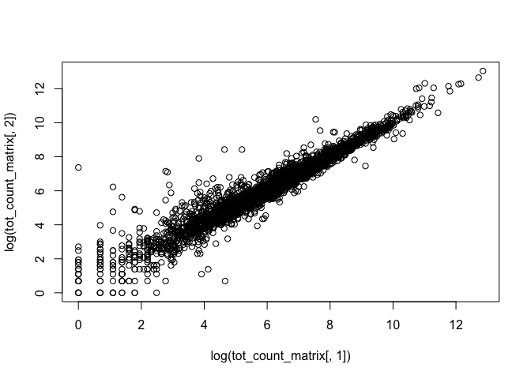 

Now we set up the data frame for the experimental design. All of the info we need is in the `parse_names` variable.Let's take a look at `parse_names` again.


```r
head(parse_names)
```

```
##      [,1]   [,2] [,3]     [,4]     [,5]     [,6]   [,7]          
## [1,] "F101" "lg" "female" "hdhorn" "CGATGT" "L008" "results.xprs"
## [2,] "F105" "lg" "female" "hdhorn" "GCCAAT" "L006" "results.xprs"
## [3,] "F131" "lg" "female" "hdhorn" "CGATGT" "L001" "results.xprs"
## [4,] "F135" "sm" "female" "hdhorn" "GTTTCG" "L003" "results.xprs"
## [5,] "F136" "sm" "female" "hdhorn" "GTGAAA" "L007" "results.xprs"
## [6,] "F196" "sm" "female" "hdhorn" "AGTTCC" "L002" "results.xprs"
```


```r
experimental_design = data.frame(
    sample_names = col_names_counts,  # sample name
    individual = factor(parse_names[,1]), # each individual beetle
    size = factor(parse_names[,2]),  # small or large beetle
    sex = factor(parse_names[,3]),   # male or females
    #tissue = factor(parse_names[,4]),  # tissue type, we don't need it.
    lane = factor(parse_names[,6])      # Whick lane on the Illumina flowcell.
    )
```

## Preliminary Quality Control analysis
Before we begin any real analysis. It pays to take some looks at the data. I am not going to go through a full exploratory data analysis session here. But some obvious plots

It is well known that there can be substantial lane to lane variation. For this experiment, it was designed so that 8 samples were run in each lane (barcoded), in a complete block randomized design. This enables us to control for lane effects if necessary. So let's take a look.

First we create a DESeq data object using our counts, experimental design and a simple statistical model (more on this later)


```r
test_lane_effects <- DESeqDataSetFromMatrix(tot_count_matrix, experimental_design, 
    design = formula(~ lane))

test_lane_effects2 <- DESeq(test_lane_effects) # We know fit the simple model
```

```
## estimating size factors
## estimating dispersions
## gene-wise dispersion estimates
## mean-dispersion relationship
## final dispersion estimates
## fitting model and testing
```

This generates a fairly complex object

```r
#str(test_lane_effects2)
```

For the moment we can ask whether any genes show evidence of different expression based solely on lane to lane variation.


```r
test_lane_effects2_results <- results(test_lane_effects2)
summary(test_lane_effects2_results) # No evidence, but this is a bit incomplete
```

```
## 
## out of 5076 with nonzero total read count
## adjusted p-value < 0.1
## LFC > 0 (up)     : 0, 0% 
## LFC < 0 (down)   : 0, 0% 
## outliers [1]     : 0, 0% 
## low counts [2]   : 0, 0% 
## (mean count < 0.1)
## [1] see 'cooksCutoff' argument of ?results
## [2] see 'independentFiltering' argument of ?results
```

We can also plot the mean-dispersion relationship for this data.


```r
plotDispEsts(test_lane_effects2) 
```

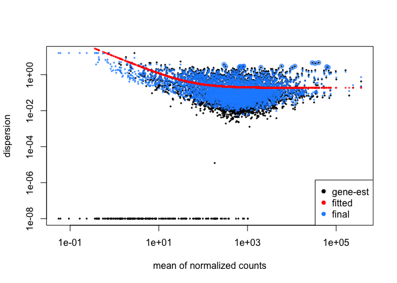 
Let's talk about what this means.

### Principal Components analysis and hierarchical clustering are useful tools to visualize patterns (and to identify potential confounds)

 We can also use some multivariate approaches to look at variation. For PCA (checking it with a "blind" dispersion estimate to look for any funky effects. Not for biological inference).


```r
for_pca <- rlog(test_lane_effects2, blind=TRUE) 
```
`rlog` is one approach to asjusting for both library size and dispersopm among samples. `blind=TRUE`, has it ignore information from the model (in this case lane).


```r
plotPCA(for_pca, intgroup=c("lane")) # no obvious lane effects.
```

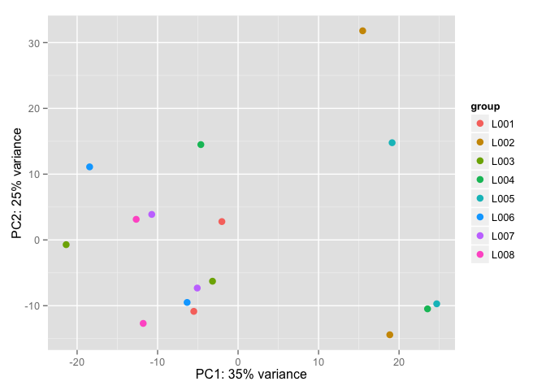 

and now for sex and size


```r
plotPCA(for_pca, intgroup=c("sex", "size"))
```

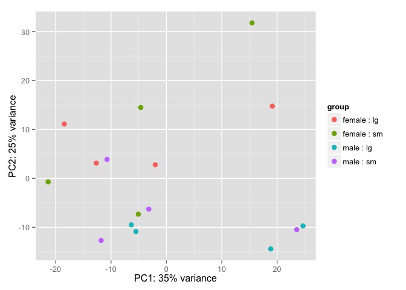 

### We can also use some hierarchical clustering

For distance matrix for clustering QC

```r
rlogMat <- assay(for_pca) # just making a matrix of the counts that have been corrected for over-dispersion in a "blind" fashion
distsRL <- dist(t(rlogMat)) # Computes a distance matrix (Euclidian Distance)
mat <- as.matrix(distsRL)  # Make sure it is a matrix
```

We need to rename our new matrix of distances based on the samples.

```r
rownames(mat) <- colnames(mat) <-     with(colData(test_lane_effects2), paste(sex, size, lane, sep=" : "))
    
hc <- hclust(distsRL)  # performs hierarchical clustering
hmcol <- colorRampPalette(brewer.pal(9, "GnBu"))(100)  # picking our colours
```

Now we generate the plot

```r
heatmap.2(mat, Rowv=as.dendrogram(hc),
          symm=TRUE, trace="none",
          col = rev(hmcol), margin=c(13, 13))
```

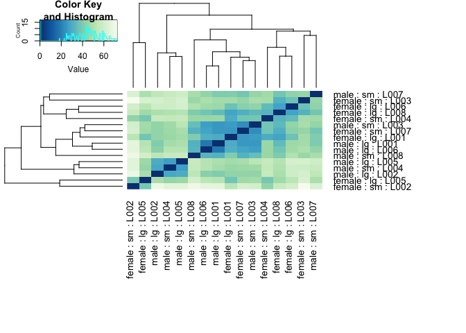 

 While I checked that there was no evidence of lane effects (see the Likelihood Ratio Test below), I am keeping it in the model as it seems to have little effects. However, it is using up "df" (in the parameter estimation sense), so it may be worth ultimately getting rid of it.


## Proceeding with the real analysis we care about! 
Given the results from above, I am removing lane entirely.


```r
DESeq_data <- DESeqDataSetFromMatrix(tot_count_matrix, experimental_design, 
    design = formula(~ sex + size + sex:size))

DESeq_data <- DESeq(DESeq_data)
```

```
## estimating size factors
## estimating dispersions
## gene-wise dispersion estimates
## mean-dispersion relationship
## final dispersion estimates
## fitting model and testing
## -- standard model matrices are used for factors with two levels and an interaction,
##    where the main effects are for the reference level of other factors.
##    see the 'Interactions' section of the vignette for more details: vignette('DESeq2')
```

While everything is stored, by default DESeq2 is evaluating the final term in the model. In this case evidence of interactions between sex and size. We can look at thse


```r
plotDispEsts(DESeq_data)
```

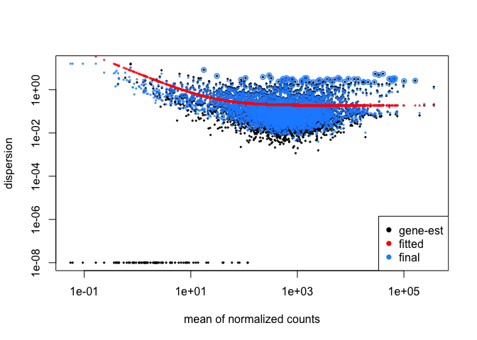 


```r
plotMA(DESeq_data, ylim=c(-2,2))
```

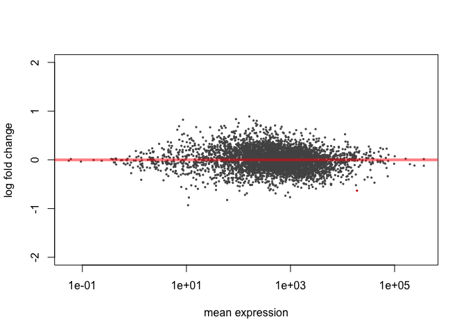 

Let's look at the results


```r
res1 <- results(DESeq_data, pAdjustMethod="BH") # How do we deal with correcting for multiple comparisons.

head(res1)
```

```
## log2 fold change (MAP): sexmale.sizesm 
## Wald test p-value: sexmale.sizesm 
## DataFrame with 6 rows and 6 columns
##                                                            baseMean
##                                                           <numeric>
## c1_g1_i1&514..1527@gi|91093034|ref|XP_970412.1|           422.06820
## c100_g1_i1&108..818@gi|91091192|ref|XP_972192.1|           32.42903
## c10000_g1_i2&1070..1519@gi|189240491|ref|XP_001810703.1| 3697.37582
## c10003_g2_i1&57..953@gi|189237943|ref|XP_001811459.1|      65.73021
## c10004_g1_i5&77..784@gi|642924690|ref|XP_008194399.1|      14.23623
## c10006_g1_i1&290..1591@gi|642920893|ref|XP_973626.3|       61.02054
##                                                          log2FoldChange
##                                                               <numeric>
## c1_g1_i1&514..1527@gi|91093034|ref|XP_970412.1|             0.149358222
## c100_g1_i1&108..818@gi|91091192|ref|XP_972192.1|            0.446694320
## c10000_g1_i2&1070..1519@gi|189240491|ref|XP_001810703.1|   -0.064080820
## c10003_g2_i1&57..953@gi|189237943|ref|XP_001811459.1|       0.276591281
## c10004_g1_i5&77..784@gi|642924690|ref|XP_008194399.1|      -0.073799880
## c10006_g1_i1&290..1591@gi|642920893|ref|XP_973626.3|       -0.005066566
##                                                              lfcSE
##                                                          <numeric>
## c1_g1_i1&514..1527@gi|91093034|ref|XP_970412.1|          0.2070437
## c100_g1_i1&108..818@gi|91091192|ref|XP_972192.1|         0.2840509
## c10000_g1_i2&1070..1519@gi|189240491|ref|XP_001810703.1| 0.2287034
## c10003_g2_i1&57..953@gi|189237943|ref|XP_001811459.1|    0.2651469
## c10004_g1_i5&77..784@gi|642924690|ref|XP_008194399.1|    0.2190148
## c10006_g1_i1&290..1591@gi|642920893|ref|XP_973626.3|     0.2041956
##                                                                 stat
##                                                            <numeric>
## c1_g1_i1&514..1527@gi|91093034|ref|XP_970412.1|           0.72138489
## c100_g1_i1&108..818@gi|91091192|ref|XP_972192.1|          1.57258528
## c10000_g1_i2&1070..1519@gi|189240491|ref|XP_001810703.1| -0.28019184
## c10003_g2_i1&57..953@gi|189237943|ref|XP_001811459.1|     1.04316248
## c10004_g1_i5&77..784@gi|642924690|ref|XP_008194399.1|    -0.33696296
## c10006_g1_i1&290..1591@gi|642920893|ref|XP_973626.3|     -0.02481232
##                                                             pvalue
##                                                          <numeric>
## c1_g1_i1&514..1527@gi|91093034|ref|XP_970412.1|          0.4706727
## c100_g1_i1&108..818@gi|91091192|ref|XP_972192.1|         0.1158149
## c10000_g1_i2&1070..1519@gi|189240491|ref|XP_001810703.1| 0.7793303
## c10003_g2_i1&57..953@gi|189237943|ref|XP_001811459.1|    0.2968730
## c10004_g1_i5&77..784@gi|642924690|ref|XP_008194399.1|    0.7361448
## c10006_g1_i1&290..1591@gi|642920893|ref|XP_973626.3|     0.9802047
##                                                               padj
##                                                          <numeric>
## c1_g1_i1&514..1527@gi|91093034|ref|XP_970412.1|          0.9999802
## c100_g1_i1&108..818@gi|91091192|ref|XP_972192.1|         0.9999802
## c10000_g1_i2&1070..1519@gi|189240491|ref|XP_001810703.1| 0.9999802
## c10003_g2_i1&57..953@gi|189237943|ref|XP_001811459.1|    0.9999802
## c10004_g1_i5&77..784@gi|642924690|ref|XP_008194399.1|    0.9999802
## c10006_g1_i1&290..1591@gi|642920893|ref|XP_973626.3|     0.9999802
```

```r
summary(res1) # only one gene which seems to be showing evidence of significant differences between size and sex
```

```
## 
## out of 5076 with nonzero total read count
## adjusted p-value < 0.1
## LFC > 0 (up)     : 0, 0% 
## LFC < 0 (down)   : 1, 0.02% 
## outliers [1]     : 37, 0.73% 
## low counts [2]   : 0, 0% 
## (mean count < 0.1)
## [1] see 'cooksCutoff' argument of ?results
## [2] see 'independentFiltering' argument of ?results
```

```r
resultsNames(DESeq_data)
```

```
## [1] "Intercept"          "sex_male_vs_female" "size_sm_vs_lg"     
## [4] "sexmale.sizesm"
```

Just to keep in mind. We expect a priori, with no true "signifcant" hits an approximately uniform distribution that looks like


```r
p_fake <- rbeta(5076, 1,1) # you could also use runif(5076,1,1)
hist(p_fake)
```

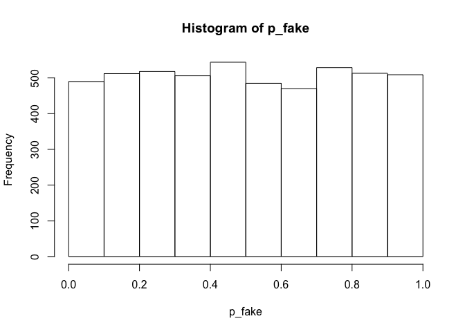 

But we actually observe

```r
hist(res1$pvalue)
```

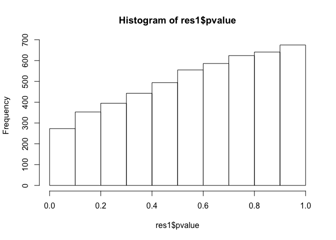 

FDR methods exploit this.


### Contrasts with DESeq2 

We can now look at specific planned contrasts (in this case male VS female). 


```r
res_contrast_sex_hdhorn <- results(DESeq_data, 
    contrast=list(c("sex_male_vs_female")), 
    pAdjustMethod="BH")
```


```r
plotMA(res_contrast_sex_hdhorn) 
```

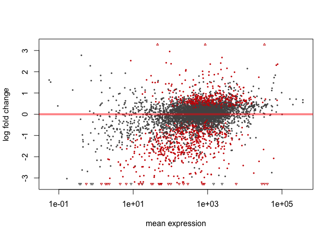 
It looks like many more genes are showing evidence of differential expression.


```r
res_contrast_sex_hdhorn <- res_contrast_sex_hdhorn[order(res_contrast_sex_hdhorn$padj),] # Sorting genes based on "significance"... yuck.
head(res_contrast_sex_hdhorn)
```

```
## log2 fold change (MAP): sex_male_vs_female effect 
## Wald test p-value: sex_male_vs_female effect 
## DataFrame with 6 rows and 6 columns
##                                                           baseMean
##                                                          <numeric>
## c13309_g1_i1&381..3329@gi|642922737|ref|XP_008193304.1|  3321.6900
## c13895_g1_i1&40..600@gi|642912129|ref|XP_966308.2|      18941.0317
## c11799_g1_i3&177..1004@gi|91082327|ref|XP_974606.1|      2272.2644
## c9824_g1_i4&86..2518@gi|91092640|ref|XP_969145.1|        1274.6929
## c10543_g1_i3&395..1423@gi|642938091|ref|XP_008190378.1|   155.8273
## c13074_g6_i2&1705..2502@gi|189236266|ref|XP_974475.2|     220.3801
##                                                         log2FoldChange
##                                                              <numeric>
## c13309_g1_i1&381..3329@gi|642922737|ref|XP_008193304.1|      2.1615325
## c13895_g1_i1&40..600@gi|642912129|ref|XP_966308.2|           0.7937278
## c11799_g1_i3&177..1004@gi|91082327|ref|XP_974606.1|          0.9505307
## c9824_g1_i4&86..2518@gi|91092640|ref|XP_969145.1|           -0.7479408
## c10543_g1_i3&395..1423@gi|642938091|ref|XP_008190378.1|     -2.9141189
## c13074_g6_i2&1705..2502@gi|189236266|ref|XP_974475.2|       -2.2872664
##                                                             lfcSE
##                                                         <numeric>
## c13309_g1_i1&381..3329@gi|642922737|ref|XP_008193304.1| 0.2084865
## c13895_g1_i1&40..600@gi|642912129|ref|XP_966308.2|      0.1010133
## c11799_g1_i3&177..1004@gi|91082327|ref|XP_974606.1|     0.1362995
## c9824_g1_i4&86..2518@gi|91092640|ref|XP_969145.1|       0.1095547
## c10543_g1_i3&395..1423@gi|642938091|ref|XP_008190378.1| 0.4291651
## c13074_g6_i2&1705..2502@gi|189236266|ref|XP_974475.2|   0.3413740
##                                                              stat
##                                                         <numeric>
## c13309_g1_i1&381..3329@gi|642922737|ref|XP_008193304.1| 10.367732
## c13895_g1_i1&40..600@gi|642912129|ref|XP_966308.2|       7.857658
## c11799_g1_i3&177..1004@gi|91082327|ref|XP_974606.1|      6.973841
## c9824_g1_i4&86..2518@gi|91092640|ref|XP_969145.1|       -6.827097
## c10543_g1_i3&395..1423@gi|642938091|ref|XP_008190378.1| -6.790205
## c13074_g6_i2&1705..2502@gi|189236266|ref|XP_974475.2|   -6.700177
##                                                               pvalue
##                                                            <numeric>
## c13309_g1_i1&381..3329@gi|642922737|ref|XP_008193304.1| 3.476790e-25
## c13895_g1_i1&40..600@gi|642912129|ref|XP_966308.2|      3.913815e-15
## c11799_g1_i3&177..1004@gi|91082327|ref|XP_974606.1|     3.084028e-12
## c9824_g1_i4&86..2518@gi|91092640|ref|XP_969145.1|       8.665025e-12
## c10543_g1_i3&395..1423@gi|642938091|ref|XP_008190378.1| 1.119740e-11
## c13074_g6_i2&1705..2502@gi|189236266|ref|XP_974475.2|   2.081678e-11
##                                                                 padj
##                                                            <numeric>
## c13309_g1_i1&381..3329@gi|642922737|ref|XP_008193304.1| 1.751955e-21
## c13895_g1_i1&40..600@gi|642912129|ref|XP_966308.2|      9.860858e-12
## c11799_g1_i3&177..1004@gi|91082327|ref|XP_974606.1|     5.180139e-09
## c9824_g1_i4&86..2518@gi|91092640|ref|XP_969145.1|       1.091577e-08
## c10543_g1_i3&395..1423@gi|642938091|ref|XP_008190378.1| 1.128474e-08
## c13074_g6_i2&1705..2502@gi|189236266|ref|XP_974475.2|   1.748263e-08
```

How many are differentially regulated?

```r
summary(res_contrast_sex_hdhorn, alpha= 0.05) 
```

```
## 
## out of 5076 with nonzero total read count
## adjusted p-value < 0.05
## LFC > 0 (up)     : 298, 5.9% 
## LFC < 0 (down)   : 458, 9% 
## outliers [1]     : 37, 0.73% 
## low counts [2]   : 0, 0% 
## (mean count < 0.1)
## [1] see 'cooksCutoff' argument of ?results
## [2] see 'independentFiltering' argument of ?results
```

Specifying nominal alpha.. Let's look at the histogram of expected p-values when there is nothing interesting going on.


```r
length(res_contrast_sex_hdhorn$padj[res_contrast_sex_hdhorn$padj < 0.05])
```

```
## [1] 793
```

```r
attr(DESeq_data, "modelMatrixType") 
```

```
## [1] "standard"
```
Type of model matrix, expanded or treatment contrast. For more complex models this is very important to understand.


## Checking results for head horns


```r
hd_horn <- factor(parse_names[,4])
hd_horn == "hdhorn" # Just setting up a logical statement to use to extract the columns and rows we need.
```

```
##  [1] TRUE TRUE TRUE TRUE TRUE TRUE TRUE TRUE TRUE TRUE TRUE TRUE TRUE TRUE
## [15] TRUE TRUE
```

subsetting for hd horn

```r
tot_count_hd_horn <- tot_count_matrix[ , hd_horn == "hdhorn"]

experimental_design_hd_horn <- experimental_design[hd_horn == "hdhorn",]

#experimental_design_hd_horn$tissue <- droplevels(experimental_design_hd_horn$tissue)
#experimental_design_hd_horn$sample_names <- droplevels(experimental_design_hd_horn$sample_names)
```

Checking that nothing went amiss 

```r
colnames(tot_count_hd_horn) == experimental_design_hd_horn$sample_names
```

```
##  [1] TRUE TRUE TRUE TRUE TRUE TRUE TRUE TRUE TRUE TRUE TRUE TRUE TRUE TRUE
## [15] TRUE TRUE
```

## head horn analysis 


```r
DESeq_hdhorn <- DESeqDataSetFromMatrix(tot_count_hd_horn, experimental_design_hd_horn, 
    design = formula(~ sex))
DESeq_hdhorn$sex <- relevel(DESeq_hdhorn$sex, "male" )
 
DESeq_hdhorn <- DESeq(DESeq_hdhorn)
```

```
## estimating size factors
## estimating dispersions
## gene-wise dispersion estimates
## mean-dispersion relationship
## final dispersion estimates
## fitting model and testing
## -- replacing outliers and refitting for 93 genes
## -- DESeq argument 'minReplicatesForReplace' = 7 
## -- original counts are preserved in counts(dds)
## estimating dispersions
## fitting model and testing
```

```r
res_hd_horn <- results(DESeq_hdhorn, alpha=0.05)
attr(DESeq_hdhorn , "modelMatrixType")
```

```
## [1] "expanded"
```

Let's take a look


```r
summary(res_hd_horn, alpha= 0.05)
```

```
## 
## out of 5076 with nonzero total read count
## adjusted p-value < 0.05
## LFC > 0 (up)     : 469, 9.2% 
## LFC < 0 (down)   : 387, 7.6% 
## outliers [1]     : 0, 0% 
## low counts [2]   : 0, 0% 
## (mean count < 0.1)
## [1] see 'cooksCutoff' argument of ?results
## [2] see 'independentFiltering' argument of ?results
```


```r
plotMA(res_hd_horn, ylim=c(-3,3))
```

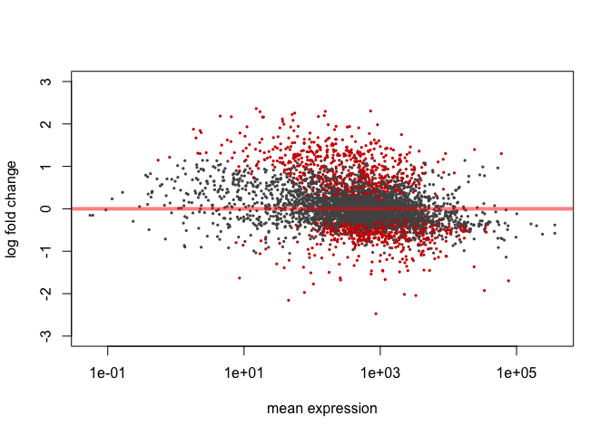 

And the contrast

```r
contrast_hd_horn_sex <- results(DESeq_hdhorn, contrast=c("sex", "male", "female"))
res_hd_horn <- res_hd_horn[order(res_hd_horn$padj),]
hd_horn_SSD <- res_hd_horn[res_hd_horn$padj < 0.05,]
hd_horn_SSD_df <- as.data.frame(hd_horn_SSD) # make data frame to make more usable.
hd_horn_SSD_df$FB.protein <- rownames(hd_horn_SSD_df)


hdhorn_dat <- data.frame(res_hd_horn@listData$baseMean, res_hd_horn@listData$log2FoldChange, res_hd_horn@listData$padj )
colnames(hdhorn_dat) <- c("baseMean", "log2FoldChange", "padj" )
```

Some expression mean plots


```r
plot(y = log2(res_hd_horn$baseMean), x =(log2(res_hd_horn$baseMean) - res_hd_horn$log2FoldChange ), 
    ylab = "mean expression males", xlab = "mean expression females", xlim=c(-5, 20), ylim=c(-5, 20),
    main = "head horn", pch = 20, col ="grey")
with(hdhorn_dat[hdhorn_dat$padj <0.05, ],
    points(y = log2(baseMean),x =(log2(baseMean) - log2FoldChange ),
    pch=20, col = "black" ))  
abline(a=0, b=1 , col="blue")
```

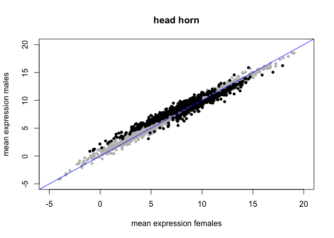 

# custom MA plot

```r
plot(y = res_hd_horn$log2FoldChange, x =log2(res_hd_horn$baseMean) , 
    ylab = "log2 fold change (M/F)", xlab = "mean expression males",
    main = " MAplot sex differences in the head horn", pch = 20, col ="grey")
with(hdhorn_dat[hdhorn_dat$padj <0.05, ],
    points(y = log2FoldChange,x = log2(baseMean),
    pch=20, col = "black" ))  
abline(a=0, b=0 , col="blue")
```

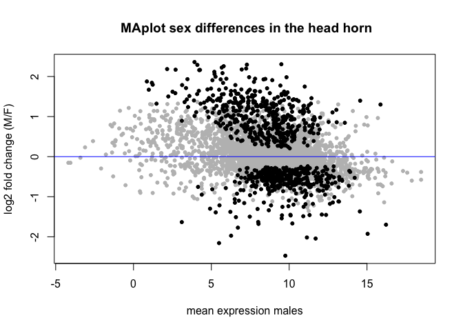 

Notice something different about fitting the sex effect as a contrast in a larger model VS as its own model?
   
