# Plotting in R

## Why base `R` plotting

Anyone who has done more than a little bit of plotting in `R` in the past 3-5 years has probably heard of other plotting libraries in `R`. Indeed there are many of them, and some are profoundly useful and general. In particular many like Hadley Wickham's `ggplot2` library based on the *grammar of graphics* and the `lattice` library on Trellis graphics system. Both of these are extremely powerful, and in particular `ggplot2` is worth getting to know.

Having said this, the following tutorial is primarily using functions in base `R` and not putatitively ancillary libraries (although many aRgue that `ggplot2` is for all intent, a base library). This is simply because, despite the syntax being based on standard `R syntax`, and not a potentially easy to learn "grammar" (essentially a macro language within `R`) like `ggplot2`, I think there is real value in being able to interact more directly with your plotting objects. In addition, many examples that are very useful still use base R. At the bottom of this tutorial, I do provide some useful links to other libraries and examples.

So with that, let us begin.

## Import the data
We are going to use the same data set that we used for the data munging tutorial.


```r
dll_data = read.csv("http://datadryad.org/bitstream/handle/10255/dryad.8377/dll.csv", header=TRUE)

dll_data <- na.omit(dll_data)
```

## Our first plot

Not surprisingly, we are going to start with the `plot()` function, and successively build complexity into our plots.

To make things easier to look like, we are going to use a subset of just 300 observations to start with. We will deal with what happens when we have lots of data (so that the plotting window is very crowded) a bit later.

So first I am making a random subset of the larger data set (just 300 of the rows randomly selected)

```r
dll_data_subset <- dll_data[sample(nrow(dll_data), 300, replace = F),]
```


```r
plot(femur ~ tibia,
     data = dll_data_subset)
```

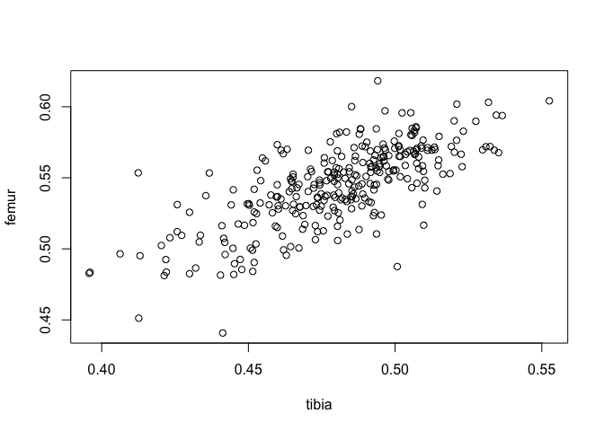<!-- -->

This provides a very basic scatterplot of the two variables femur and tarsus. If you are using RStudio, then the plots window needs to be big enough to show the whole plot. Also in Rstudio the quality may not look high, but if you save it (Export) as a PDF it will look better. If you are using the standard R GUI for Mac OSX, then it will look a bit better as well.

Also, instead of using formula notation for `femur ~ tibia` we can alternatively just specify `y = femur, x = tibia` to get the same results.

Clearly you get a sense that there is some positive relationship between these two variables (likely reflecting how they both covary with overall body size).

However we may wish to make this plot look a bit nicer, and potentially more informative. When you are trying to get more information about arguments, don't just use `?plot` but also `?plot.default` and `?par`, which have lots of information! 


```r
plot(femur ~ tibia,
     pch = 20, # symbol
     cex = 1.2, # size of symbol
     col = "blue", # symbol colour
     xlim = c(0.40, 0.57),
     ylim = c(0.42, 0.62),
     xlab = " tibia length",
     ylab = "femur length",
     main = "leg lengths measures",
     bty = "n",
     data = dll_data_subset)
```

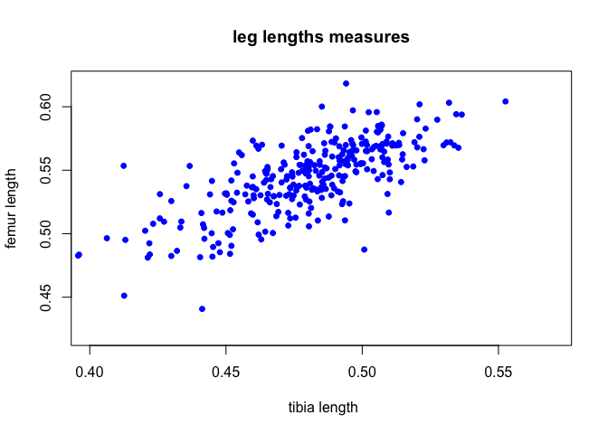<!-- -->

Most of these parameters are easily explained.

`pch` is "page character". i.e. what symbol you want to use. Typically between 1:25, although there are special things you can do. Check [here](http://www.endmemo.com/program/R/pchsymbols.php) for more info.

`cex` is "character expand", which is how big you want the characters on the plot to be. 1 is default.

`col` is for "color". These can be done by names or numbers. Check [here](http://research.stowers-institute.org/efg/R/Color/Chart/ColorChart.pdf) for examples.

`xlim` sets the range for the plot on the X axis. Ditto for the y axis (`ylim`). In this case I have put both axes on the same range.

`xlab` "xlabel" labels the x axis.

`main` is for the main title.

`bty` determines the type of box around the plot (if any)

### Exercise

1- Remake this plot but change the colour of characters to red.
 
2- Remake this plot but but use triangles instead of circles for the characters.

3- Remake this plot but use **ALL** the data not just the subset. What do you notice about the figure? What parameters might you change to make the plot clearer?

4- Finally, remake the plot, but use `SCT` instead of `femur`. What do you notice about this plot? How can you explain it? (we will fix it later)

## A bit more complexity

This is fine, but sometimes we want to change the colour or the shape of the characters to match specific levels of factors. Going back to this data set we can see that we have two levels of genotype and two temperatures. How might we make the figure have different colour and shapes for the page characters to match this. Since we are using `R` it will probably not surprise you to know that the key is using *indexing*.

First let's remind ourselves about the structure of the 


```r
str(dll_data)
```

```
## 'data.frame':	1918 obs. of  8 variables:
##  $ replicate: int  1 1 1 1 1 1 1 1 1 1 ...
##  $ line     : Factor w/ 27 levels "line-1","line-11",..: 1 1 1 1 1 1 1 1 1 1 ...
##  $ genotype : Factor w/ 2 levels "Dll","wt": 1 1 1 1 1 1 1 1 1 1 ...
##  $ temp     : int  25 25 25 25 25 25 25 25 25 25 ...
##  $ femur    : num  0.59 0.55 0.588 0.596 0.577 ...
##  $ tibia    : num  0.499 0.501 0.488 0.502 0.499 ...
##  $ tarsus   : num  0.219 0.214 0.211 0.207 0.207 ...
##  $ SCT      : int  9 13 11 12 14 11 12 10 12 13 ...
##  - attr(*, "na.action")= 'omit' Named int  4 61 73 92 93 142 207 268 315 319 ...
##   ..- attr(*, "names")= chr  "4" "61" "73" "92" ...
```
Currently temperature (`temp`) remains an integer. We will make this a factor. How do you do so?


```r
dll_data_subset$temp <- factor(dll_data_subset$temp)
```

So let's change the page characters (`pch`) to match the different temperatures. We have two temps (25 and 30) so we will need a vector of length two to represent the two page characters we are using. i.e. `pch = c(16, 17)`. Try making this change to the code above and see what happens to your plot.


```r
plot(femur ~ tibia,
     pch = c(16,17), # symbol
     cex = 0.95, # size of symbol
     col = "blue", # symbol colour
     xlim = c(0.4, 0.57),
     ylim = c(0.4, 0.62),
     xlab = " tibia length",
     ylab = "femur length",
     main = "leg lengths measures",
     data = dll_data_subset)
```

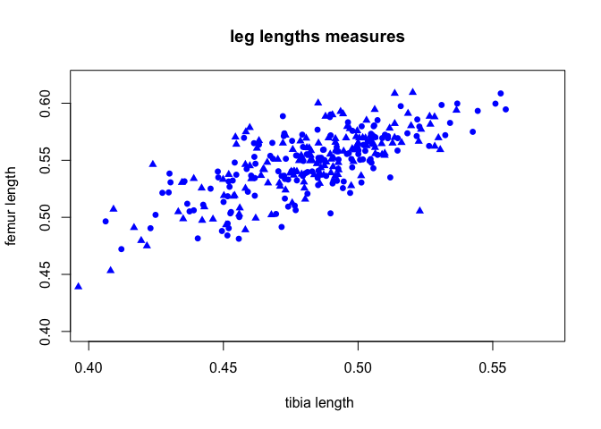<!-- -->

It clearly made some triangles and some circles. But how does it no which ones? **IT DOESN'T**. We have not yet told `R` which points we want to be circles or triangles. Thus in addition to pointing out that we want 2 characters, we have to let it know that we want these characters to represent each level of the `temp` variable (which should now be a factor). We do this using the index. i.e. `pch = c(16, 17)[dll_data$temp]


```r
plot(femur ~ tibia,
     pch = c(16, 17)[dll_data_subset$temp], # symbol
     cex = 0.95, # size of symbol
     col = "blue", # symbol colour
     xlim = c(0.4, 0.57),
     ylim = c(0.4, 0.62),
     xlab = " tibia length",
     ylab = "femur length",
     main = "leg lengths measures",
     data = dll_data_subset)
```

<!-- -->

Now we can do the same thing for colour using genotype. Try it yourself. Make sure to use the full data. Colour is a bit easier as it can accept a factor and convert it to a numeric without any problem.


```r
plot(femur ~ tibia,
     pch = c(16,17)[dll_data_subset$temp], # symbol
     cex = 0.95, # size of symbol
     col = dll_data_subset$genotype, # symbol colour
     xlim = c(0.4, 0.57),
     ylim = c(0.4, 0.62),
     xlab = " tibia length",
     ylab = "femur length",
     main = "leg lengths measures",
     data = dll_data_subset)
```

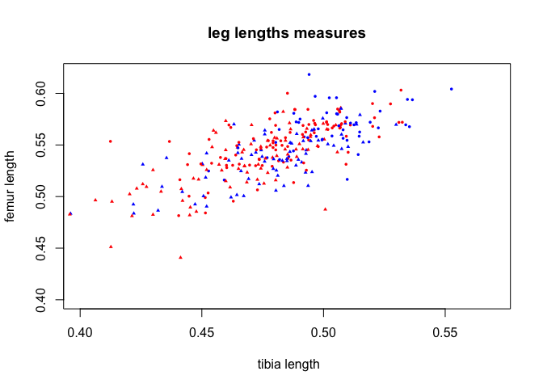<!-- -->

### Legends
Which colours are which? Well `R` does this alphanumerically. So 25 (`pch = 16`) comes before 30 (`pch = 17`) and *Dll* (blue) before *wt* (red). Although we could use `relevel()` to change this.

Of we would prefer having a legend to do this for us. So how do we make a legend? Using the `legend()` function of course!


```r
plot(femur ~ tibia,
     pch = c(16,17)[dll_data_subset$temp], # symbol
     cex = 0.95, # size of symbol
     col = genotype, # symbol colour
     xlim = c(0.4, 0.57),
     ylim = c(0.4, 0.62),
     xlab = " tibia length",
     ylab = "femur length",
     main = "leg lengths measures",
     data = dll_data_subset)

legend(x = "bottomright", 
       legend  = c("wt 25C", "wt 30C", "Dll 25C", "Dll 30C"),
       pch = c(16, 17, 16, 17),
       col = c(rep("red", 2), rep("blue", 2)))
```

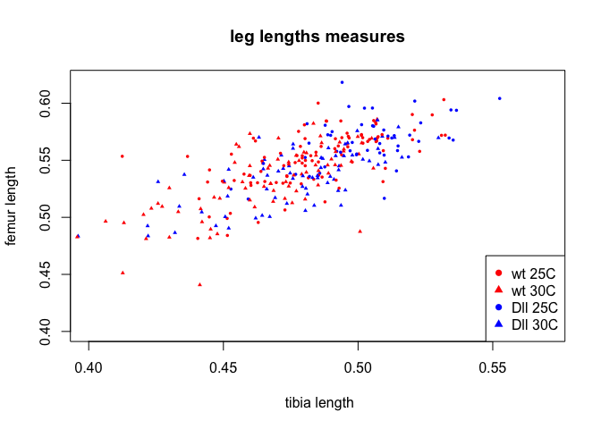<!-- -->

Because of the weirdness of plotting in R studio, you may need to stretch the plot window and then call legend.

### Exercises
1 - Instead of making different colour and character combinations for genotype and temp, just use 4 different colours for the 4 combinations (hint you may wish to make a variable using the `interaction` function or `paste`).

## Jitter
A few minutes ago, I had you plot with the variable `SCT` (sex comb teeth), which are discrete entities and as such are integers. Not surprisingly this can make things hard for plotting. Not so much because of the fact that they are stored as integers, but because you can have many observations of exactly the same values.


```r
plot(SCT ~ tibia,
     pch = c(16,17)[dll_data_subset$temp], # symbol
     cex = 0.85, # size of symbol
     col = c("blue", "red")[dll_data_subset$genotype], # symbol colour
     xlim = c(0.4, 0.57),
     ylim = c(8, 18),
     xlab = " tibia length",
     ylab = "Number of Sex Comb Teeth",
     main = "leg lengths measures",
     data = dll_data_subset)
```

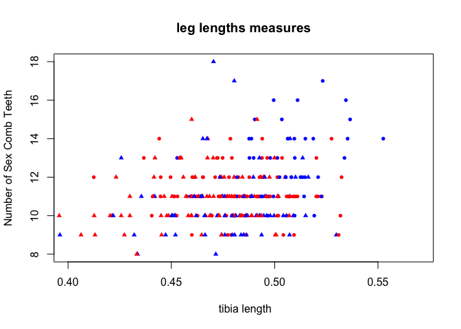<!-- -->
Even with only 300 individuals, it can be difficult to discern many of the observations. One standard thing to do is add a bit of "noise" (or jitter) to the values of the integers (in this case the `SCT`)


```r
plot(jitter(SCT) ~ tibia,
     pch = c(16,17)[dll_data_subset$temp], # symbol
     cex = 0.95, # size of symbol
     col = c("blue", "red")[dll_data_subset$genotype], # symbol colour
     xlim = c(0.4, 0.57),
     ylim = c(8, 18),
     xlab = " tibia length",
     ylab = "Number of Sex Comb Teeth",
     main = "leg lengths measures",
     data = dll_data_subset)
```

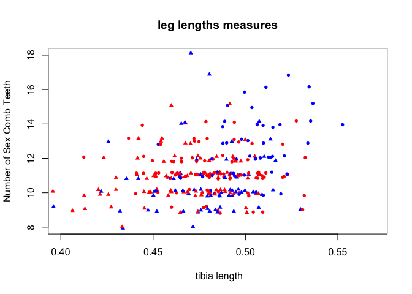<!-- -->
### Exercise

Using the `R` help functions on `jitter`, find out how you would increase or decrease the amount of jitter.


## Adding lines.

There are many reasons we would want to add lines (or more points, or more text) to a plot. `R` handles all of these pretty easily. In this case, let's say we wanted to re-plot the previous example but show a certain region of particular interest (say at the means of both values). We can add lines across the graph using the `abline()` specifies the a (intercept)  or "b" (slope of a line), but can also do vertical or horizontal lines.


```r
plot(jitter(SCT) ~ tarsus,
     pch = c(16,17)[dll_data_subset$temp], # symbol
     cex = 0.95, # size of symbol
     col = c("blue", "red")[dll_data_subset$genotype], # symbol colour
     ylim = c(8, 18),
     xlab = " tarsus length",
     ylab = "Number of Sex Comb Teeth",
     main = "leg lengths measures",
     data = dll_data_subset)

abline(v = mean(dll_data_subset$tarsus))
abline(h = mean(dll_data_subset$SCT))
```

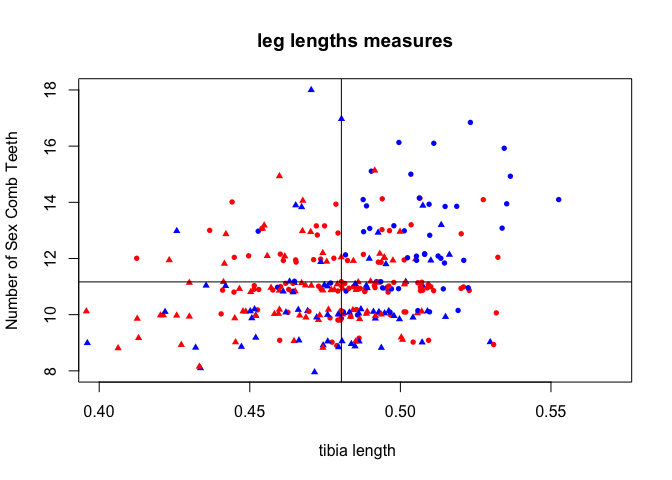<!-- -->


Well that's great and all, but those lines are a bit confusing with the axes. So how about we stipple the lines, colour them grey and make them a bit thicker.

First we need to replot the plot (you can do this). Then we can modify our previous call to `abline()`


```r
plot(jitter(SCT) ~ tarsus,
     pch = c(16,17)[dll_data_subset$temp], # symbol
     cex = 0.95, # size of symbol
     col = c("blue", "red")[dll_data_subset$genotype], # symbol colour
     ylim = c(8, 18),
     xlab = " tarsus length",
     ylab = "Number of Sex Comb Teeth",
     main = "leg lengths measures",
     data = dll_data_subset)

abline(v = mean(dll_data_subset$tarsus),
       lwd = 2, # line width,
       lty = 2, # stippling of line
       col = "darkgrey")

abline(h = mean(dll_data_subset$SCT),
       lwd = 2, lty = 2, col = "darkgrey" )
```

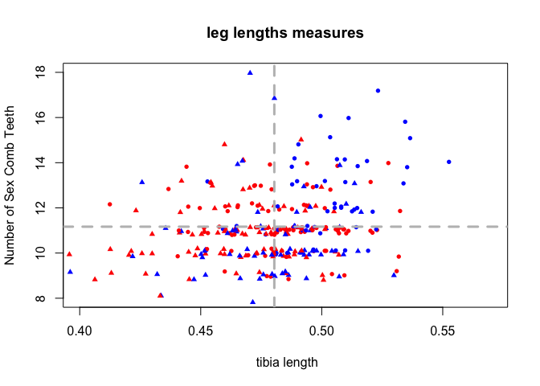<!-- -->

- `lty` changes the **l**ine **ty**pe. 1 is solid, as you increase you get various dashed or stippled lines.

- `lwd` is **l**ine **w**i**d**th, or line thickness.

This is not the nicest representation of this, but we will come back to it later. 

The real power in the `abline()` is for fitting best fit lines or curves through the data, and then plotting these. 

First we will fit a regression of SCT onto tarsus length (the leg segment where the SCT are situated.)


```r
mod1 <- lm(SCT ~ tarsus, 
           data = dll_data_subset)
```

Then we can make the plot we want.


```r
plot(jitter(SCT) ~ tarsus,
     pch = c(16,17)[dll_data_subset$temp], # symbol
     cex = 0.75, # size of symbol
     col = c("blue", "red")[dll_data_subset$genotype], # symbol colour
     xlab = " tarsus length",
     ylab = "Number of Sex Comb Teeth",
     main = "SCT VS tarsus",
     data = dll_data_subset)

# and then plot based on the model fit.

abline(mod1, lwd = 2, lty = 2)
```

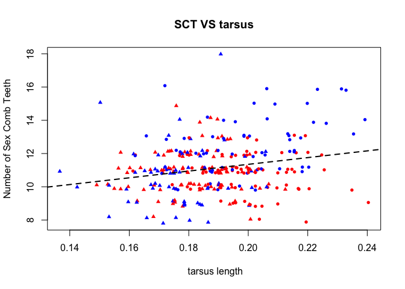<!-- -->
### Exercises
1 - Make a plot of SCT VS tarsus, but add lines at the mean of SCT and tarsus in grey (solid lines), and the best fit line from the regression in black.


### Adding multiple lines for each subgroup

Say we wanted to add different best fit lines for each subgroup (i.e. by genotype)? We can pretty easily modify this, using `lapply()`


```r
plot(jitter(SCT) ~ tarsus,
     pch = c(16,17)[dll_data_subset$temp],
     cex = 0.75, 
     col = dll_data_subset$genotype,
     xlab = " tarsus length",
     ylab = "Number of Sex Comb Teeth",
     main = "SCT VS tarsus",
     data = dll_data_subset)

abline(lm(SCT ~ tarsus, data = dll_data_subset), lty = 2, lwd =2, col = "grey")

lapply(dll_data_subset$genotype, 
       function(x) {
           abline(lm(SCT ~ tarsus, dll_data_subset, subset = (genotype == x)), col = x)
  })
```

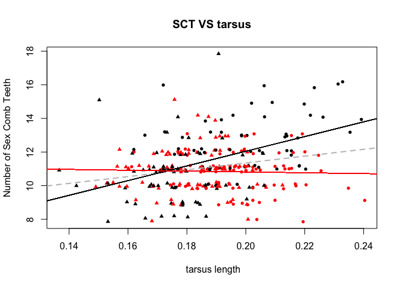<!-- -->

```
## [[1]]
## NULL
## 
## [[2]]
## NULL
## 
## [[3]]
## NULL
## 
## [[4]]
## NULL
## 
## [[5]]
## NULL
## 
## [[6]]
## NULL
## 
## [[7]]
## NULL
## 
## [[8]]
## NULL
## 
## [[9]]
## NULL
## 
## [[10]]
## NULL
## 
## [[11]]
## NULL
## 
## [[12]]
## NULL
## 
## [[13]]
## NULL
## 
## [[14]]
## NULL
## 
## [[15]]
## NULL
## 
## [[16]]
## NULL
## 
## [[17]]
## NULL
## 
## [[18]]
## NULL
## 
## [[19]]
## NULL
## 
## [[20]]
## NULL
## 
## [[21]]
## NULL
## 
## [[22]]
## NULL
## 
## [[23]]
## NULL
## 
## [[24]]
## NULL
## 
## [[25]]
## NULL
## 
## [[26]]
## NULL
## 
## [[27]]
## NULL
## 
## [[28]]
## NULL
## 
## [[29]]
## NULL
## 
## [[30]]
## NULL
## 
## [[31]]
## NULL
## 
## [[32]]
## NULL
## 
## [[33]]
## NULL
## 
## [[34]]
## NULL
## 
## [[35]]
## NULL
## 
## [[36]]
## NULL
## 
## [[37]]
## NULL
## 
## [[38]]
## NULL
## 
## [[39]]
## NULL
## 
## [[40]]
## NULL
## 
## [[41]]
## NULL
## 
## [[42]]
## NULL
## 
## [[43]]
## NULL
## 
## [[44]]
## NULL
## 
## [[45]]
## NULL
## 
## [[46]]
## NULL
## 
## [[47]]
## NULL
## 
## [[48]]
## NULL
## 
## [[49]]
## NULL
## 
## [[50]]
## NULL
## 
## [[51]]
## NULL
## 
## [[52]]
## NULL
## 
## [[53]]
## NULL
## 
## [[54]]
## NULL
## 
## [[55]]
## NULL
## 
## [[56]]
## NULL
## 
## [[57]]
## NULL
## 
## [[58]]
## NULL
## 
## [[59]]
## NULL
## 
## [[60]]
## NULL
## 
## [[61]]
## NULL
## 
## [[62]]
## NULL
## 
## [[63]]
## NULL
## 
## [[64]]
## NULL
## 
## [[65]]
## NULL
## 
## [[66]]
## NULL
## 
## [[67]]
## NULL
## 
## [[68]]
## NULL
## 
## [[69]]
## NULL
## 
## [[70]]
## NULL
## 
## [[71]]
## NULL
## 
## [[72]]
## NULL
## 
## [[73]]
## NULL
## 
## [[74]]
## NULL
## 
## [[75]]
## NULL
## 
## [[76]]
## NULL
## 
## [[77]]
## NULL
## 
## [[78]]
## NULL
## 
## [[79]]
## NULL
## 
## [[80]]
## NULL
## 
## [[81]]
## NULL
## 
## [[82]]
## NULL
## 
## [[83]]
## NULL
## 
## [[84]]
## NULL
## 
## [[85]]
## NULL
## 
## [[86]]
## NULL
## 
## [[87]]
## NULL
## 
## [[88]]
## NULL
## 
## [[89]]
## NULL
## 
## [[90]]
## NULL
## 
## [[91]]
## NULL
## 
## [[92]]
## NULL
## 
## [[93]]
## NULL
## 
## [[94]]
## NULL
## 
## [[95]]
## NULL
## 
## [[96]]
## NULL
## 
## [[97]]
## NULL
## 
## [[98]]
## NULL
## 
## [[99]]
## NULL
## 
## [[100]]
## NULL
## 
## [[101]]
## NULL
## 
## [[102]]
## NULL
## 
## [[103]]
## NULL
## 
## [[104]]
## NULL
## 
## [[105]]
## NULL
## 
## [[106]]
## NULL
## 
## [[107]]
## NULL
## 
## [[108]]
## NULL
## 
## [[109]]
## NULL
## 
## [[110]]
## NULL
## 
## [[111]]
## NULL
## 
## [[112]]
## NULL
## 
## [[113]]
## NULL
## 
## [[114]]
## NULL
## 
## [[115]]
## NULL
## 
## [[116]]
## NULL
## 
## [[117]]
## NULL
## 
## [[118]]
## NULL
## 
## [[119]]
## NULL
## 
## [[120]]
## NULL
## 
## [[121]]
## NULL
## 
## [[122]]
## NULL
## 
## [[123]]
## NULL
## 
## [[124]]
## NULL
## 
## [[125]]
## NULL
## 
## [[126]]
## NULL
## 
## [[127]]
## NULL
## 
## [[128]]
## NULL
## 
## [[129]]
## NULL
## 
## [[130]]
## NULL
## 
## [[131]]
## NULL
## 
## [[132]]
## NULL
## 
## [[133]]
## NULL
## 
## [[134]]
## NULL
## 
## [[135]]
## NULL
## 
## [[136]]
## NULL
## 
## [[137]]
## NULL
## 
## [[138]]
## NULL
## 
## [[139]]
## NULL
## 
## [[140]]
## NULL
## 
## [[141]]
## NULL
## 
## [[142]]
## NULL
## 
## [[143]]
## NULL
## 
## [[144]]
## NULL
## 
## [[145]]
## NULL
## 
## [[146]]
## NULL
## 
## [[147]]
## NULL
## 
## [[148]]
## NULL
## 
## [[149]]
## NULL
## 
## [[150]]
## NULL
## 
## [[151]]
## NULL
## 
## [[152]]
## NULL
## 
## [[153]]
## NULL
## 
## [[154]]
## NULL
## 
## [[155]]
## NULL
## 
## [[156]]
## NULL
## 
## [[157]]
## NULL
## 
## [[158]]
## NULL
## 
## [[159]]
## NULL
## 
## [[160]]
## NULL
## 
## [[161]]
## NULL
## 
## [[162]]
## NULL
## 
## [[163]]
## NULL
## 
## [[164]]
## NULL
## 
## [[165]]
## NULL
## 
## [[166]]
## NULL
## 
## [[167]]
## NULL
## 
## [[168]]
## NULL
## 
## [[169]]
## NULL
## 
## [[170]]
## NULL
## 
## [[171]]
## NULL
## 
## [[172]]
## NULL
## 
## [[173]]
## NULL
## 
## [[174]]
## NULL
## 
## [[175]]
## NULL
## 
## [[176]]
## NULL
## 
## [[177]]
## NULL
## 
## [[178]]
## NULL
## 
## [[179]]
## NULL
## 
## [[180]]
## NULL
## 
## [[181]]
## NULL
## 
## [[182]]
## NULL
## 
## [[183]]
## NULL
## 
## [[184]]
## NULL
## 
## [[185]]
## NULL
## 
## [[186]]
## NULL
## 
## [[187]]
## NULL
## 
## [[188]]
## NULL
## 
## [[189]]
## NULL
## 
## [[190]]
## NULL
## 
## [[191]]
## NULL
## 
## [[192]]
## NULL
## 
## [[193]]
## NULL
## 
## [[194]]
## NULL
## 
## [[195]]
## NULL
## 
## [[196]]
## NULL
## 
## [[197]]
## NULL
## 
## [[198]]
## NULL
## 
## [[199]]
## NULL
## 
## [[200]]
## NULL
## 
## [[201]]
## NULL
## 
## [[202]]
## NULL
## 
## [[203]]
## NULL
## 
## [[204]]
## NULL
## 
## [[205]]
## NULL
## 
## [[206]]
## NULL
## 
## [[207]]
## NULL
## 
## [[208]]
## NULL
## 
## [[209]]
## NULL
## 
## [[210]]
## NULL
## 
## [[211]]
## NULL
## 
## [[212]]
## NULL
## 
## [[213]]
## NULL
## 
## [[214]]
## NULL
## 
## [[215]]
## NULL
## 
## [[216]]
## NULL
## 
## [[217]]
## NULL
## 
## [[218]]
## NULL
## 
## [[219]]
## NULL
## 
## [[220]]
## NULL
## 
## [[221]]
## NULL
## 
## [[222]]
## NULL
## 
## [[223]]
## NULL
## 
## [[224]]
## NULL
## 
## [[225]]
## NULL
## 
## [[226]]
## NULL
## 
## [[227]]
## NULL
## 
## [[228]]
## NULL
## 
## [[229]]
## NULL
## 
## [[230]]
## NULL
## 
## [[231]]
## NULL
## 
## [[232]]
## NULL
## 
## [[233]]
## NULL
## 
## [[234]]
## NULL
## 
## [[235]]
## NULL
## 
## [[236]]
## NULL
## 
## [[237]]
## NULL
## 
## [[238]]
## NULL
## 
## [[239]]
## NULL
## 
## [[240]]
## NULL
## 
## [[241]]
## NULL
## 
## [[242]]
## NULL
## 
## [[243]]
## NULL
## 
## [[244]]
## NULL
## 
## [[245]]
## NULL
## 
## [[246]]
## NULL
## 
## [[247]]
## NULL
## 
## [[248]]
## NULL
## 
## [[249]]
## NULL
## 
## [[250]]
## NULL
## 
## [[251]]
## NULL
## 
## [[252]]
## NULL
## 
## [[253]]
## NULL
## 
## [[254]]
## NULL
## 
## [[255]]
## NULL
## 
## [[256]]
## NULL
## 
## [[257]]
## NULL
## 
## [[258]]
## NULL
## 
## [[259]]
## NULL
## 
## [[260]]
## NULL
## 
## [[261]]
## NULL
## 
## [[262]]
## NULL
## 
## [[263]]
## NULL
## 
## [[264]]
## NULL
## 
## [[265]]
## NULL
## 
## [[266]]
## NULL
## 
## [[267]]
## NULL
## 
## [[268]]
## NULL
## 
## [[269]]
## NULL
## 
## [[270]]
## NULL
## 
## [[271]]
## NULL
## 
## [[272]]
## NULL
## 
## [[273]]
## NULL
## 
## [[274]]
## NULL
## 
## [[275]]
## NULL
## 
## [[276]]
## NULL
## 
## [[277]]
## NULL
## 
## [[278]]
## NULL
## 
## [[279]]
## NULL
## 
## [[280]]
## NULL
## 
## [[281]]
## NULL
## 
## [[282]]
## NULL
## 
## [[283]]
## NULL
## 
## [[284]]
## NULL
## 
## [[285]]
## NULL
## 
## [[286]]
## NULL
## 
## [[287]]
## NULL
## 
## [[288]]
## NULL
## 
## [[289]]
## NULL
## 
## [[290]]
## NULL
## 
## [[291]]
## NULL
## 
## [[292]]
## NULL
## 
## [[293]]
## NULL
## 
## [[294]]
## NULL
## 
## [[295]]
## NULL
## 
## [[296]]
## NULL
## 
## [[297]]
## NULL
## 
## [[298]]
## NULL
## 
## [[299]]
## NULL
## 
## [[300]]
## NULL
```


There is **SO MUCH** more to learn about these basic plots, but since we only have one class, I want to show you some other plotting types.

## boxplots

Boxplots are a common plot type to demonstrate variation in the data as well as measures of central tendencies (like the median). It is in general a good place to start to show raw data.

Not surprisingly in base R the function to produce a boxplot is called `boxplot`


```r
boxplot(SCT ~ genotype, 
        data  = dll_data,
        ylab = " # SCT",
        notch = TRUE)
```

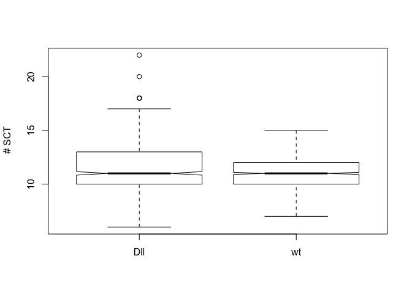<!-- -->

This is pretty simple, but it is easy to modify based on many things, including sample size, range, etc..  I will leave some of these for exercises.

### Exercises
1 - Look through the help function and find out how to adjust to the boxwidths so that they are related to the sample size of each group.


```r
boxplot(SCT ~ genotype, 
        data  = dll_data_subset,
        ylab = " # SCT",
        varwidth = TRUE)
```

<!-- -->
Another common type of plot related to this is called a stripchart. These are useful for small sample sizes.


```r
stripchart( jitter(SCT) ~ genotype,
            data = dll_data_subset)
```

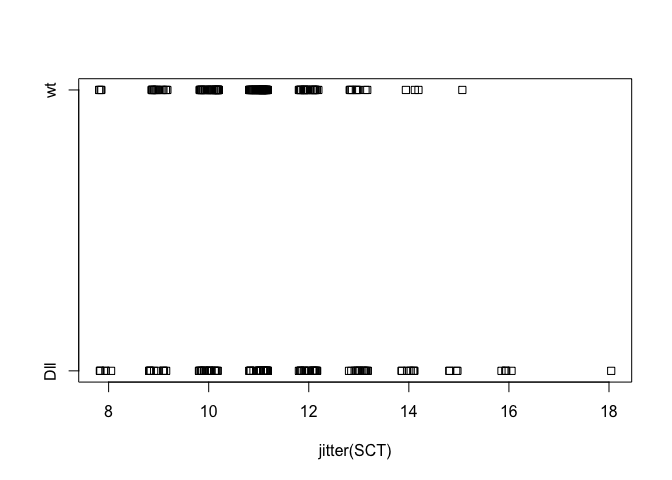<!-- -->

I happen to really like to add the raw points to boxplots. Here is such an example.First we need to make sure we are suppressing the outliers (which are just outlier observ)


```r
boxplot(SCT ~ genotype, 
        data  = dll_data_subset,
        ylab = " # SCT",
        varwidth = TRUE,
        col = "blue",
        outline = FALSE,
        # Suppress observations
        ylim = c(8, 20))
```

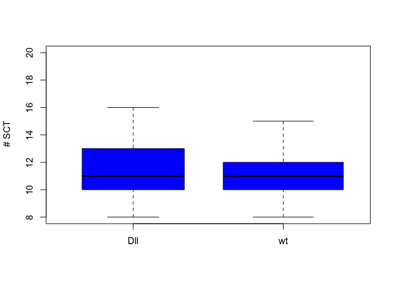<!-- -->

Now we "over-plot" new points onto the first plotting window.


```r
boxplot(SCT ~ genotype, 
        data  = dll_data_subset,
        ylab = " # SCT",
        varwidth = TRUE,
        col = "blue",
        outline = FALSE,
        # Suppress observations
        ylim = c(8, 20))

with(dll_data_subset,
     points(y = SCT, 
            x = genotype,
            col = "red"))
```

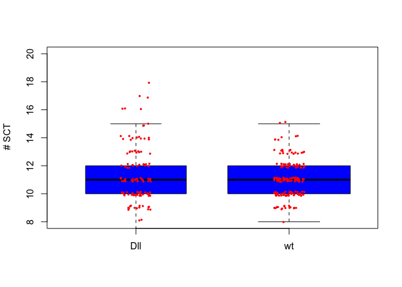<!-- -->
### Exercise

1- How might you improve this boxplot to make the raw observations a bit clearer?


```r
boxplot(SCT ~ genotype, 
        data  = dll_data_subset,
        ylab = " # SCT",
        varwidth = TRUE,
        col = "blue",
        outline = FALSE,
        # Suppress observations
        ylim = c(8, 20))

with(dll_data_subset,
     points(y = jitter(SCT, factor = 0.85), 
            x = jitter(as.numeric(genotype), factor = 1),
            col = "red", pch = 16, cex = 0.5))
```

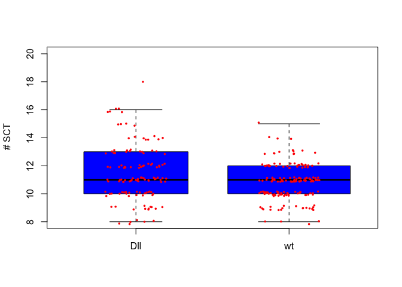<!-- -->

## Histograms.

Another useful type of plot to make is a histogram. Again not surprisingly R has a function `hist()` that is made to do this.

Let's look at a histogram of all of the SCT data.


```r
with(dll_data, 
     hist(SCT))
```

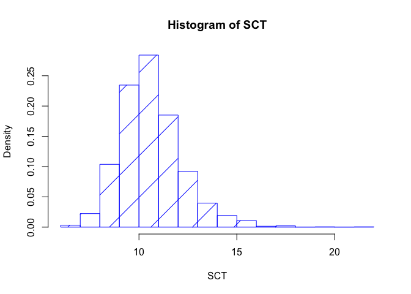<!-- -->
There may be a lot of things we would want to change in this figure. The two most obvious is the number of breaks, and whether instead of frequency we get a proportion. These are both pretty straightforward.


```r
with(dll_data, 
     hist(SCT, 
          breaks = 12,
          freq = FALSE, # For prob. densities
          density = 4, #lines through bars.
          col = "blue"
          ))
```

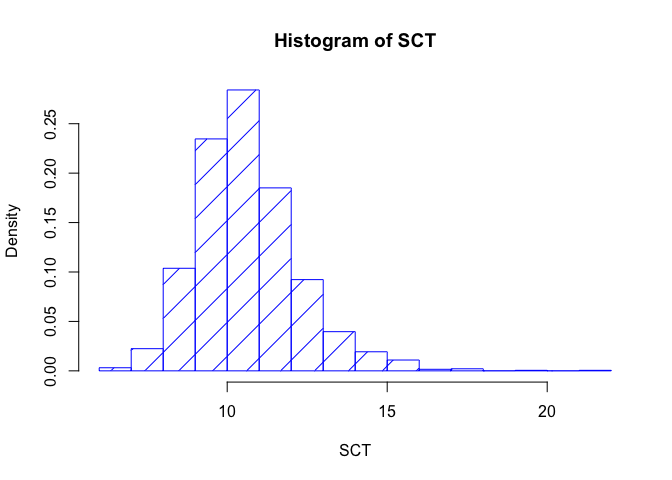<!-- -->


### Exercises
1 - Play with breaks and also setting the xlim to different ranges to see how it effects your plot.
### Some additional complexity. 
What if we wanted to plot the histograms of the number of SCT for each genotype? We could do two seperate plots.  We are going to use the `par()` function to set the options for the number of plots in the graphical device.


```r
par(mfrow = c(2,1)) 
# mfrow is setting up number of plots by row

with(dll_data[dll_data$genotype == "Dll",], 
     hist(SCT, 
          breaks = 13,
          freq = FALSE, # For prob. densities
          col = "red",
          xlim = c(7, 20)
          ))

with(dll_data[dll_data$genotype == "wt",], 
     hist(SCT, 
          breaks = 9,
          freq = FALSE, # For prob. densities
          col = "blue",
          xlim = c(7, 20)
          ))
```

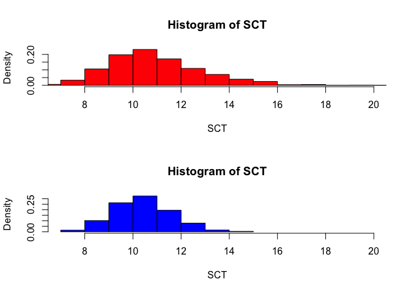<!-- -->

However, sometimes, you may want everything on a single plot.

We need to let `R` know to return to the original plotting arrangement


```r
par(mfrow = c(1,1)) # one plotting window
```


```r
# Generate subsets by genotype
SCT_Dll <- subset(dll_data, 
                 subset = genotype =="Dll" )

SCT_wt <- subset(dll_data, 
                 subset = genotype =="wt" )

SCT <- dll_data$SCT
# First we will draw the histogram  

hist(SCT_Dll$SCT, 
     col= "grey",
  # Sometimes the default breaks are not so good, so here we use a sequence from lowest observed SCT to highest
     breaks = seq(min(SCT), max(SCT)), # sets up breaks for histograms
  
  # Since we are planning on displaying two data sets, we need to make sure our y axis goes high enough
  # below we compute the tables for # of SCT for each subset
      ylim = c(0, max( c(table(SCT), table(SCT)))),  # sets up the maximum
  
  # Ditto for  the x axis
     xlim = c(min(SCT), max(SCT)),
  
     main = "Sex Comb Teeth in Drosophila",  
  
     xlab = " # Sex Comb Teeth ", 
     border = "black") # this is where the call to hist ends!
  
# Now we add on a second histogram  
hist(SCT_wt$SCT,
     col= "red",
     density = 4,  # number of "crossing" lines
     border = "red",  # The border colour for the histogram
     breaks=seq(min(SCT), max(SCT)), 
     add = TRUE)

#Perhaps a legend would also be useful here

legend("topright",
       
       # Sometimes for our text we want to use italics or generate a mathematical expression. we use expression()
       # for more details ?text or ?plotmath
       legend = c( expression(italic("Distal-less/+")), 
          expression(italic("wild-type"))),
       
       col = c("grey", "red"),  # Setting up the colours for the legend box
       lwd=4)   # lwd sets the line width
```

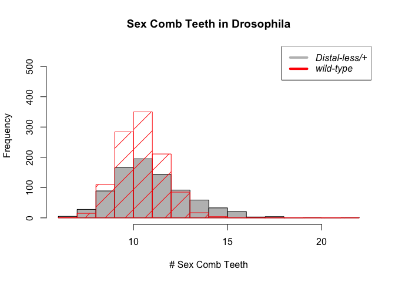<!-- -->
This `add = TRUE ` enables us to overplot on the single graphics window. R sometimes gives grief at trying to do this (which is why so many people prefer ggplot2), although there are many tricks one can do! If you don't decide to go the route of ggplot2, let me know as I have a short tutorial on tricks for over-plotting with base R.

### Exercise
- Change the histogram to do proportion (probability density), instead of frequency. Also change the line shading and colours!


## R plotting examples
A little googling usually finds what you are looking for.

- [R plotting examples](http://shinyapps.org/apps/RGraphCompendium/index.php). There are way more examples out there. 

- [ggplot2](http://www.statmethods.net/advgraphs/ggplot2.html). Also, here is a [link to the book](https://www.amazon.com/ggplot2-Elegant-Graphics-Data-Analysis/dp/0387981403). In addition to activities on datacamp, there are many online tutorials and cheatsheets for ggplot2, in addition to the 
