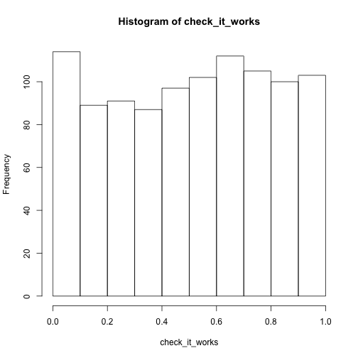

In class this week our [in class activity][./R_exercise_InClass.md] worked to import some RNAseq count data sets, examine them and then do some simple plotting. Below I summarize how we went about doing each step. **Please keep in mind** this is a fairly inefficient way to do it, but they are good for practicing `R` fundamentals. I will go over in class (in a few weeks) a much better approach to do these types of operations.

# importing data into `R`
After you have downloaded the data onto your local machine, and placed them in your project directory, you need to navigate to that directory with the files. For me (on my computer) that would be:

#```{r}
#setwd("~/Dropbox/Bio720/Sept28_data/")
#```

We will then import the data into `R`. For large numbers of files (or large files) there are a number of tricks that we will learn in the near future. For now, since we only have 4 files we will do them individually.


```r
file1_sm <- read.table("~/Dropbox/Bio720/Sept28_data/M200_sm_male_hdhorn_ACAGTG_L008_results.xprs", h=T)
file2_sm <- read.table("~/Dropbox/Bio720/Sept28_data/M172_sm_male_hdhorn_ATCACG_L003_results.xprs", h=T)
file3_lg <- read.table("~/Dropbox/Bio720/Sept28_data/M257_lg_male_hdhorn_ATGTCA_L002_results.xprs", h=T)
file4_lg <- read.table("~/Dropbox/Bio720/Sept28_data/M180_lg_male_hdhorn_CAGATC_L001_results.xprs", h=T)
```

## Checking that the data imported correctly

It is always important to check that the data imported correctly. So check the numbers of rows and columns for each to make sure. You could use `dim()` or `str()` to do so. i.e. (repeat for each file).


```r
str(file1_sm)
```

```
## 'data.frame':	5076 obs. of  15 variables:
##  $ bundle_id        : int  1 2 3 4 5 6 6 6 7 8 ...
##  $ target_id        : Factor w/ 5076 levels "c1_g1_i1&514..1527@gi|91093034|ref|XP_970412.1|",..: 3521 3631 4078 4191 132 1340 1342 1341 4637 1765 ...
##  $ length           : int  2204 2715 1613 1983 1782 2372 3071 3911 3864 1378 ...
##  $ eff_length       : num  1512 2426 990 1129 855 ...
##  $ tot_counts       : int  101 56250 1414 524 416 306 611 698 390 2111 ...
##  $ uniq_counts      : int  101 56250 1414 524 416 2 18 27 390 2111 ...
##  $ est_counts       : num  101 56250 1414 524 416 ...
##  $ eff_counts       : num  147 62951 2304 920 867 ...
##  $ ambig_distr_alpha: num  0 0 0 0 0 ...
##  $ ambig_distr_beta : num  0 0 0 0 0 ...
##  $ fpkm             : num  6.95 2412.95 148.68 48.28 50.65 ...
##  $ fpkm_conf_low    : num  6.95 2412.95 148.68 48.28 50.65 ...
##  $ fpkm_conf_high   : num  6.95 2412.95 148.68 48.28 50.65 ...
##  $ solvable         : logi  TRUE TRUE TRUE TRUE TRUE TRUE ...
##  $ tpm              : num  8.61 2986.52 184.02 59.76 62.69 ...
```
(How can you compare this to the number of lines in the original file? at the command line?)

I would also typically check the `head()` and `tail()` of each file as well. Since this has 15 columns it will not print out nicely to the screen. However you should do it for each file.

## Re-ordering the data

As I mentioned in class. [eXpress](http://bio.math.berkeley.edu/eXpress/overview.html) does not order all of the genes for each different file. You can see that here for two of the files.


```r
file1_sm[1:3,1:3]
```

```
##   bundle_id                                               target_id length
## 1         1 c14024_g9_i1&210..1715@gi|642924700|ref|XP_001815479.2|   2204
## 2         2  c2096_g1_i1&253..2082@gi|642911248|ref|XP_008199756.1|   2715
## 3         3      c6852_g1_i5&344..1528@gi|91084991|ref|XP_972796.1|   1613
```

```r
file2_sm[1:3,1:3]
```

```
##   bundle_id                                                target_id
## 1         1 c13072_g1_i1&2681..3649@gi|642918577|ref|XP_008199343.1|
## 2         2      c11451_g3_i1&320..2092@gi|91079919|ref|XP_967329.1|
## 3         3  c13899_g1_i1&115..1710@gi|189236814|ref|XP_001811847.1|
##   length
## 1   7265
## 2   3729
## 3   1716
```

So we need to sort them so that we can compare them (i.e each row corresponds to the same genes). There are some libraries (namely `plyr` and `dplyr`) that can help with this, but we will use the "standard" `R` approach, by re-ordering based on a column using the index. Let's first do this for one.


```r
file1_ordered <- file1_sm[order(file1_sm$target_id), ]
```

So what have we done? Well we are making a new object (`file1_ordered`) copied from the original file. However, instead of copying it exactly we are re-ordering the rows (remember `[rows,columns]`) using `order()` based on one of the columns (`target_id`). 

Let's go ahead and do this for each of the files:

```r
file2_ordered <- file2_sm[order(file2_sm$target_id), ]
file3_ordered <- file3_lg[order(file3_lg$target_id), ]
file4_ordered <- file4_lg[order(file4_lg$target_id), ]
```

Now let us check that they are the same sizes as before

```r
dim(file1_ordered)
```

```
## [1] 5076   15
```

```r
dim(file2_ordered)
```

```
## [1] 5076   15
```

```r
dim(file3_ordered)
```

```
## [1] 5076   15
```

```r
dim(file4_ordered)
```

```
## [1] 5076   15
```

And that they have been re-ordered properly.


```r
file1_ordered[1:3,2]
```

```
## [1] c1_g1_i1&514..1527@gi|91093034|ref|XP_970412.1|         
## [2] c100_g1_i1&108..818@gi|91091192|ref|XP_972192.1|        
## [3] c10000_g1_i2&1070..1519@gi|189240491|ref|XP_001810703.1|
## 5076 Levels: c1_g1_i1&514..1527@gi|91093034|ref|XP_970412.1| ...
```

```r
file2_ordered[1:3,2]
```

```
## [1] c1_g1_i1&514..1527@gi|91093034|ref|XP_970412.1|         
## [2] c100_g1_i1&108..818@gi|91091192|ref|XP_972192.1|        
## [3] c10000_g1_i2&1070..1519@gi|189240491|ref|XP_001810703.1|
## 5076 Levels: c1_g1_i1&514..1527@gi|91093034|ref|XP_970412.1| ...
```

```r
file3_ordered[1:3,2]
```

```
## [1] c1_g1_i1&514..1527@gi|91093034|ref|XP_970412.1|         
## [2] c100_g1_i1&108..818@gi|91091192|ref|XP_972192.1|        
## [3] c10000_g1_i2&1070..1519@gi|189240491|ref|XP_001810703.1|
## 5076 Levels: c1_g1_i1&514..1527@gi|91093034|ref|XP_970412.1| ...
```

```r
file4_ordered[1:3,2]
```

```
## [1] c1_g1_i1&514..1527@gi|91093034|ref|XP_970412.1|         
## [2] c100_g1_i1&108..818@gi|91091192|ref|XP_972192.1|        
## [3] c10000_g1_i2&1070..1519@gi|189240491|ref|XP_001810703.1|
## 5076 Levels: c1_g1_i1&514..1527@gi|91093034|ref|XP_970412.1| ...
```

I will let you check the last few elements for each object as an exercise (using `tail()` or the index).

## Making a single matrix (or data.frame) for "tpm"
For a quick check we will extract one estimate of transcript abundance, the "tpm" (transcripts per million) from each of the four objects and put them in a new object together. We could do this either into a matrix (since they are all numeric) or a data.frame (which would allow us to also add gene names as a column).

So into a matrix (again sacrificing efficiency for clarity):
###matrix

```r
tpm_matrix <- cbind(file1_ordered$tpm,file2_ordered$tpm,
                    file3_ordered$tpm, file4_ordered$tpm)
head(tpm_matrix)
```

```
##             [,1]        [,2]        [,3]        [,4]
## [1,]  39.0769000  46.5170400  51.4589400  53.2875100
## [2,]   5.1333480   3.7924710   4.5601110   3.3766540
## [3,] 179.7027000 525.5646000 617.6821000 431.7534000
## [4,]   9.7519040  18.6179200  17.1112900   7.0300390
## [5,]   0.6304352   2.2406760   2.0812400   0.3069524
## [6,]   3.2603490   0.5300072   0.3161527   0.2739988
```

```r
dim(tpm_matrix)
```

```
## [1] 5076    4
```

Note that this did not maintain column names, and we have no identifiers left. We can fix this easily.


```r
colnames(tpm_matrix) <- c("sm1", "sm2", "lg1", "lg2")
head(tpm_matrix)
```

```
##              sm1         sm2         lg1         lg2
## [1,]  39.0769000  46.5170400  51.4589400  53.2875100
## [2,]   5.1333480   3.7924710   4.5601110   3.3766540
## [3,] 179.7027000 525.5646000 617.6821000 431.7534000
## [4,]   9.7519040  18.6179200  17.1112900   7.0300390
## [5,]   0.6304352   2.2406760   2.0812400   0.3069524
## [6,]   3.2603490   0.5300072   0.3161527   0.2739988
```

We could also add gene names as row names

```r
rownames(tpm_matrix) <- file1_ordered$target_id
head(tpm_matrix)
```

```
##                                                                  sm1
## c1_g1_i1&514..1527@gi|91093034|ref|XP_970412.1|           39.0769000
## c100_g1_i1&108..818@gi|91091192|ref|XP_972192.1|           5.1333480
## c10000_g1_i2&1070..1519@gi|189240491|ref|XP_001810703.1| 179.7027000
## c10003_g2_i1&57..953@gi|189237943|ref|XP_001811459.1|      9.7519040
## c10004_g1_i5&77..784@gi|642924690|ref|XP_008194399.1|      0.6304352
## c10006_g1_i1&290..1591@gi|642920893|ref|XP_973626.3|       3.2603490
##                                                                  sm2
## c1_g1_i1&514..1527@gi|91093034|ref|XP_970412.1|           46.5170400
## c100_g1_i1&108..818@gi|91091192|ref|XP_972192.1|           3.7924710
## c10000_g1_i2&1070..1519@gi|189240491|ref|XP_001810703.1| 525.5646000
## c10003_g2_i1&57..953@gi|189237943|ref|XP_001811459.1|     18.6179200
## c10004_g1_i5&77..784@gi|642924690|ref|XP_008194399.1|      2.2406760
## c10006_g1_i1&290..1591@gi|642920893|ref|XP_973626.3|       0.5300072
##                                                                  lg1
## c1_g1_i1&514..1527@gi|91093034|ref|XP_970412.1|           51.4589400
## c100_g1_i1&108..818@gi|91091192|ref|XP_972192.1|           4.5601110
## c10000_g1_i2&1070..1519@gi|189240491|ref|XP_001810703.1| 617.6821000
## c10003_g2_i1&57..953@gi|189237943|ref|XP_001811459.1|     17.1112900
## c10004_g1_i5&77..784@gi|642924690|ref|XP_008194399.1|      2.0812400
## c10006_g1_i1&290..1591@gi|642920893|ref|XP_973626.3|       0.3161527
##                                                                  lg2
## c1_g1_i1&514..1527@gi|91093034|ref|XP_970412.1|           53.2875100
## c100_g1_i1&108..818@gi|91091192|ref|XP_972192.1|           3.3766540
## c10000_g1_i2&1070..1519@gi|189240491|ref|XP_001810703.1| 431.7534000
## c10003_g2_i1&57..953@gi|189237943|ref|XP_001811459.1|      7.0300390
## c10004_g1_i5&77..784@gi|642924690|ref|XP_008194399.1|      0.3069524
## c10006_g1_i1&290..1591@gi|642920893|ref|XP_973626.3|       0.2739988
```

### data.frame
It may be more useful sometimes to make a data.frame out of it. This is also pretty easy:
  

```r
tpm_df <- data.frame(sm1 = file1_ordered$tpm,
                     sm2 = file2_ordered$tpm,
                     lg1 = file3_ordered$tpm, 
                     lg2 = file4_ordered$tpm, 
                     geneID = file1_ordered$target_id )
```


## correlations
To look at the correlations among the estimated tpm's for each sample, we can use the `cor()` function. This only accepts numeric variables so you can use the matrix as is, or just subset the 4 columns in the data.frame.


```r
cor(tpm_matrix)
```

```
##           sm1       sm2       lg1       lg2
## sm1 1.0000000 0.9056230 0.6586473 0.9345192
## sm2 0.9056230 1.0000000 0.8276767 0.9787425
## lg1 0.6586473 0.8276767 1.0000000 0.7695055
## lg2 0.9345192 0.9787425 0.7695055 1.0000000
```

or


```r
cor(tpm_df[,1:4])
```

```
##           sm1       sm2       lg1       lg2
## sm1 1.0000000 0.9056230 0.6586473 0.9345192
## sm2 0.9056230 1.0000000 0.8276767 0.9787425
## lg1 0.6586473 0.8276767 1.0000000 0.7695055
## lg2 0.9345192 0.9787425 0.7695055 1.0000000
```

We can also produce quick and dirty scatterplots


 
