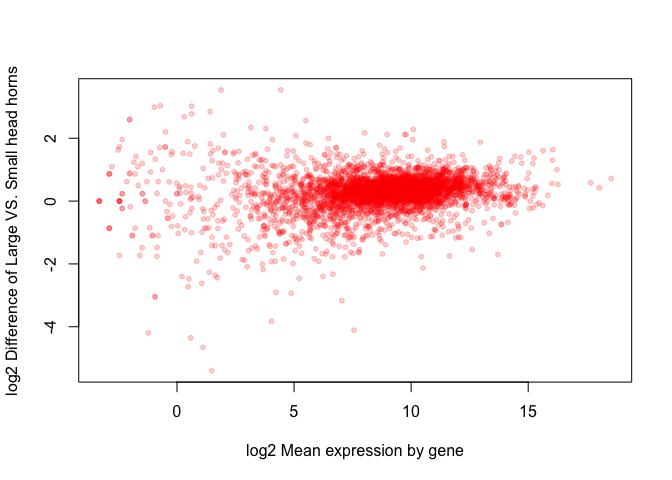

# Answers to *R* asssignment 3


## Question 2
Or wherever you have downloaded the data

```r
rna_counts <- read.csv("eXpress_dm_counts.csv", h = T)
```

Write the function


```r
mean_function <- function(x , log2Tr = FALSE) {
	if (log2Tr == TRUE) {
	  x <- log2(x + 0.0001)}
	mean(x)
}
```

Check that it works

```r
mean_function(rna_counts[,2])
```

```
## [1] 1978.847
```

```r
mean(rna_counts[,2])
```

```
## [1] 1978.847
```

```r
mean_function(rna_counts[,2], TRUE)
```

```
## [1] 8.849849
```

```r
mean(log2(rna_counts[,2]+ 0.0001)) # same
```

```
## [1] 8.849849
```

## Question 3
The -1 in `rna_counts[,-1]` is to just exclude the first column filled with identifiers.


```r
stored_values <- rep(NA, ncol(rna_counts[,-1]))
length(stored_values)
```

```
## [1] 55
```

```r
for (i in 1:ncol(rna_counts[,-1])) {
	stored_values[i] <- mean_function(rna_counts[,i+1], TRUE)
}

names(stored_values) <- colnames(rna_counts[,-1])
stored_values
```

```
##  F101_lg_female_hdhorn F101_lg_female_thxhorn   F101_lg_female_wings 
##               8.849849               8.856507               7.944590 
##  F105_lg_female_hdhorn F105_lg_female_thxhorn   F105_lg_female_wings 
##               8.972111               8.025615               8.221886 
##  F131_lg_female_hdhorn F131_lg_female_thxhorn   F131_lg_female_wings 
##               8.866964               9.224605               8.565787 
##   F135_sm_female_wings  F135_sm_female_hdhorn F135_sm_female_thxhorn 
##               8.122295               8.142346               8.720309 
##  F136_sm_female_hdhorn F136_sm_female_thxhorn   F136_sm_female_wings 
##               8.608123               8.675894               8.684715 
##  F196_sm_female_hdhorn F196_sm_female_thxhorn   F196_sm_female_wings 
##               8.380055               7.970848               9.542878 
##  F197_sm_female_hdhorn F197_sm_female_thxhorn   F197_sm_female_wings 
##               9.533030               8.814492               8.348475 
##  F218_lg_female_hdhorn F218_lg_female_thxhorn   F218_lg_female_wings 
##               9.247133               8.982573               8.428271 
## M120_sm_male_genitalia    M120_sm_male_hdhorn   M120_sm_male_thxhorn 
##               8.777693               8.484650               9.124494 
##     M120_sm_male_wings M125_lg_male_genitalia    M125_lg_male_hdhorn 
##               8.951137               8.550255               8.463305 
##     M125_lg_male_wings M160_lg_male_genitalia    M160_lg_male_hdhorn 
##               8.569691               8.697073               8.558602 
##   M160_lg_male_thxhorn     M160_lg_male_wings M171_sm_male_genitalia 
##               8.841369               8.566197               8.913073 
##    M171_sm_male_hdhorn   M171_sm_male_thxhorn     M171_sm_male_wings 
##               8.248896               8.327012               8.222550 
## M172_sm_male_genitalia    M172_sm_male_hdhorn   M172_sm_male_thxhorn 
##               9.061456               8.247524               8.079943 
##     M172_sm_male_wings M180_lg_male_genitalia    M180_lg_male_hdhorn 
##               8.897666               8.741938               8.687330 
##   M180_lg_male_thxhorn     M180_lg_male_wings M200_sm_male_genitalia 
##               8.389155               9.085971               9.212464 
##    M200_sm_male_hdhorn   M200_sm_male_thxhorn     M200_sm_male_wings 
##               8.318100               9.144372               8.451637 
## M257_lg_male_genitalia    M257_lg_male_hdhorn   M257_lg_male_thxhorn 
##               9.007848               8.652488               9.190405 
##     M257_lg_male_wings 
##               7.963432
```

```r
length(stored_values)
```

```
## [1] 55
```

Always double check your results


```r
stored_values[55]
```

```
## M257_lg_male_wings 
##           7.963432
```

```r
mean(log2(rna_counts[,56]+ 0.0001))
```

```
## [1] 7.963432
```

## Question 4


```r
apply(rna_counts[,-1], MARGIN = 2, mean_function, TRUE)
```

```
##  F101_lg_female_hdhorn F101_lg_female_thxhorn   F101_lg_female_wings 
##               8.849849               8.856507               7.944590 
##  F105_lg_female_hdhorn F105_lg_female_thxhorn   F105_lg_female_wings 
##               8.972111               8.025615               8.221886 
##  F131_lg_female_hdhorn F131_lg_female_thxhorn   F131_lg_female_wings 
##               8.866964               9.224605               8.565787 
##   F135_sm_female_wings  F135_sm_female_hdhorn F135_sm_female_thxhorn 
##               8.122295               8.142346               8.720309 
##  F136_sm_female_hdhorn F136_sm_female_thxhorn   F136_sm_female_wings 
##               8.608123               8.675894               8.684715 
##  F196_sm_female_hdhorn F196_sm_female_thxhorn   F196_sm_female_wings 
##               8.380055               7.970848               9.542878 
##  F197_sm_female_hdhorn F197_sm_female_thxhorn   F197_sm_female_wings 
##               9.533030               8.814492               8.348475 
##  F218_lg_female_hdhorn F218_lg_female_thxhorn   F218_lg_female_wings 
##               9.247133               8.982573               8.428271 
## M120_sm_male_genitalia    M120_sm_male_hdhorn   M120_sm_male_thxhorn 
##               8.777693               8.484650               9.124494 
##     M120_sm_male_wings M125_lg_male_genitalia    M125_lg_male_hdhorn 
##               8.951137               8.550255               8.463305 
##     M125_lg_male_wings M160_lg_male_genitalia    M160_lg_male_hdhorn 
##               8.569691               8.697073               8.558602 
##   M160_lg_male_thxhorn     M160_lg_male_wings M171_sm_male_genitalia 
##               8.841369               8.566197               8.913073 
##    M171_sm_male_hdhorn   M171_sm_male_thxhorn     M171_sm_male_wings 
##               8.248896               8.327012               8.222550 
## M172_sm_male_genitalia    M172_sm_male_hdhorn   M172_sm_male_thxhorn 
##               9.061456               8.247524               8.079943 
##     M172_sm_male_wings M180_lg_male_genitalia    M180_lg_male_hdhorn 
##               8.897666               8.741938               8.687330 
##   M180_lg_male_thxhorn     M180_lg_male_wings M200_sm_male_genitalia 
##               8.389155               9.085971               9.212464 
##    M200_sm_male_hdhorn   M200_sm_male_thxhorn     M200_sm_male_wings 
##               8.318100               9.144372               8.451637 
## M257_lg_male_genitalia    M257_lg_male_hdhorn   M257_lg_male_thxhorn 
##               9.007848               8.652488               9.190405 
##     M257_lg_male_wings 
##               7.963432
```
You could have used sapply or tapply as well.

## Question 5


```r
colMeans(log2(rna_counts[, -1] + 0.0001))
```

```
##  F101_lg_female_hdhorn F101_lg_female_thxhorn   F101_lg_female_wings 
##               8.849849               8.856507               7.944590 
##  F105_lg_female_hdhorn F105_lg_female_thxhorn   F105_lg_female_wings 
##               8.972111               8.025615               8.221886 
##  F131_lg_female_hdhorn F131_lg_female_thxhorn   F131_lg_female_wings 
##               8.866964               9.224605               8.565787 
##   F135_sm_female_wings  F135_sm_female_hdhorn F135_sm_female_thxhorn 
##               8.122295               8.142346               8.720309 
##  F136_sm_female_hdhorn F136_sm_female_thxhorn   F136_sm_female_wings 
##               8.608123               8.675894               8.684715 
##  F196_sm_female_hdhorn F196_sm_female_thxhorn   F196_sm_female_wings 
##               8.380055               7.970848               9.542878 
##  F197_sm_female_hdhorn F197_sm_female_thxhorn   F197_sm_female_wings 
##               9.533030               8.814492               8.348475 
##  F218_lg_female_hdhorn F218_lg_female_thxhorn   F218_lg_female_wings 
##               9.247133               8.982573               8.428271 
## M120_sm_male_genitalia    M120_sm_male_hdhorn   M120_sm_male_thxhorn 
##               8.777693               8.484650               9.124494 
##     M120_sm_male_wings M125_lg_male_genitalia    M125_lg_male_hdhorn 
##               8.951137               8.550255               8.463305 
##     M125_lg_male_wings M160_lg_male_genitalia    M160_lg_male_hdhorn 
##               8.569691               8.697073               8.558602 
##   M160_lg_male_thxhorn     M160_lg_male_wings M171_sm_male_genitalia 
##               8.841369               8.566197               8.913073 
##    M171_sm_male_hdhorn   M171_sm_male_thxhorn     M171_sm_male_wings 
##               8.248896               8.327012               8.222550 
## M172_sm_male_genitalia    M172_sm_male_hdhorn   M172_sm_male_thxhorn 
##               9.061456               8.247524               8.079943 
##     M172_sm_male_wings M180_lg_male_genitalia    M180_lg_male_hdhorn 
##               8.897666               8.741938               8.687330 
##   M180_lg_male_thxhorn     M180_lg_male_wings M200_sm_male_genitalia 
##               8.389155               9.085971               9.212464 
##    M200_sm_male_hdhorn   M200_sm_male_thxhorn     M200_sm_male_wings 
##               8.318100               9.144372               8.451637 
## M257_lg_male_genitalia    M257_lg_male_hdhorn   M257_lg_male_thxhorn 
##               9.007848               8.652488               9.190405 
##     M257_lg_male_wings 
##               7.963432
```

```r
colMeans(rna_counts[, -1])
```

```
##  F101_lg_female_hdhorn F101_lg_female_thxhorn   F101_lg_female_wings 
##               1978.847               1983.250               1583.904 
##  F105_lg_female_hdhorn F105_lg_female_thxhorn   F105_lg_female_wings 
##               2105.712               1433.749               1869.962 
##  F131_lg_female_hdhorn F131_lg_female_thxhorn   F131_lg_female_wings 
##               2117.847               2307.529               2272.692 
##   F135_sm_female_wings  F135_sm_female_hdhorn F135_sm_female_thxhorn 
##               1728.483               1452.913               1776.309 
##  F136_sm_female_hdhorn F136_sm_female_thxhorn   F136_sm_female_wings 
##               2065.780               1777.769               1988.882 
##  F196_sm_female_hdhorn F196_sm_female_thxhorn   F196_sm_female_wings 
##               1348.898               1025.301               3067.287 
##  F197_sm_female_hdhorn F197_sm_female_thxhorn   F197_sm_female_wings 
##               2639.152               2047.151               2081.889 
##  F218_lg_female_hdhorn F218_lg_female_thxhorn   F218_lg_female_wings 
##               2329.563               1950.561               2074.992 
## M120_sm_male_genitalia    M120_sm_male_hdhorn   M120_sm_male_thxhorn 
##               1832.780               2105.145               2101.163 
##     M120_sm_male_wings M125_lg_male_genitalia    M125_lg_male_hdhorn 
##               2536.920               2088.092               2372.259 
##     M125_lg_male_wings M160_lg_male_genitalia    M160_lg_male_hdhorn 
##               2559.085               1727.538               2111.337 
##   M160_lg_male_thxhorn     M160_lg_male_wings M171_sm_male_genitalia 
##               2087.583               2184.076               2035.093 
##    M171_sm_male_hdhorn   M171_sm_male_thxhorn     M171_sm_male_wings 
##               1598.190               1621.659               1825.344 
## M172_sm_male_genitalia    M172_sm_male_hdhorn   M172_sm_male_thxhorn 
##               2196.101               1713.119               1344.019 
##     M172_sm_male_wings M180_lg_male_genitalia    M180_lg_male_hdhorn 
##               2602.351               1922.634               2670.498 
##   M180_lg_male_thxhorn     M180_lg_male_wings M200_sm_male_genitalia 
##               2003.293               3216.476               2412.038 
##    M200_sm_male_hdhorn   M200_sm_male_thxhorn     M200_sm_male_wings 
##               2032.085               2820.495               2203.813 
## M257_lg_male_genitalia    M257_lg_male_hdhorn   M257_lg_male_thxhorn 
##               2170.258               2361.912               2749.767 
##     M257_lg_male_wings 
##               1325.684
```

## Question 6
It is common (say for a MAplot) to want the mean expression value of each given gene across all samples. Write a function to do this, and using one of the approaches from Q 3-5 generate and store these values in a variable.

I used the same function I wrote above, and just switched the apply function from using the function per column to per row.

```r
gene_means <- apply(rna_counts[,-1], MARGIN = 1, mean_function, TRUE)
nrow(rna_counts)
```

```
## [1] 4375
```

```r
length(gene_means)
```

```
## [1] 4375
```

Even easier to use `rowMeans()`. Below that is just demonstrating that you get the same answer.


```r
gene_means_alt <- rowMeans(log2(rna_counts[, -1] + 0.0001))

length(gene_means_alt)
```

```
## [1] 4375
```

```r
head(gene_means)
```

```
## [1]  4.320311 11.016324  6.202879  5.399514  7.083802 10.306870
```

```r
head(gene_means_alt)
```

```
## [1]  4.320311 11.016324  6.202879  5.399514  7.083802 10.306870
```

## Question 7
We are very interested in what is going on in the head horns between small males and large males. Using the type of tools you have written (feel free to modify as you need, but show the new functions) calculate the mean expression for the subset of columns for large and small male head horns. Note you are calculating means on a gene by gene basis, NOT sample by sample. Now calculate the mean difference (again gene by gene) between large male and small males (for head horns). i.e. first calculate the mean expression among individuals who are large males (head horns), ditto for the small males, and calculate their difference.

### Answer

First let's look at the names of the columns

```r
names(rna_counts)
```

```
##  [1] "X"                      "F101_lg_female_hdhorn" 
##  [3] "F101_lg_female_thxhorn" "F101_lg_female_wings"  
##  [5] "F105_lg_female_hdhorn"  "F105_lg_female_thxhorn"
##  [7] "F105_lg_female_wings"   "F131_lg_female_hdhorn" 
##  [9] "F131_lg_female_thxhorn" "F131_lg_female_wings"  
## [11] "F135_sm_female_wings"   "F135_sm_female_hdhorn" 
## [13] "F135_sm_female_thxhorn" "F136_sm_female_hdhorn" 
## [15] "F136_sm_female_thxhorn" "F136_sm_female_wings"  
## [17] "F196_sm_female_hdhorn"  "F196_sm_female_thxhorn"
## [19] "F196_sm_female_wings"   "F197_sm_female_hdhorn" 
## [21] "F197_sm_female_thxhorn" "F197_sm_female_wings"  
## [23] "F218_lg_female_hdhorn"  "F218_lg_female_thxhorn"
## [25] "F218_lg_female_wings"   "M120_sm_male_genitalia"
## [27] "M120_sm_male_hdhorn"    "M120_sm_male_thxhorn"  
## [29] "M120_sm_male_wings"     "M125_lg_male_genitalia"
## [31] "M125_lg_male_hdhorn"    "M125_lg_male_wings"    
## [33] "M160_lg_male_genitalia" "M160_lg_male_hdhorn"   
## [35] "M160_lg_male_thxhorn"   "M160_lg_male_wings"    
## [37] "M171_sm_male_genitalia" "M171_sm_male_hdhorn"   
## [39] "M171_sm_male_thxhorn"   "M171_sm_male_wings"    
## [41] "M172_sm_male_genitalia" "M172_sm_male_hdhorn"   
## [43] "M172_sm_male_thxhorn"   "M172_sm_male_wings"    
## [45] "M180_lg_male_genitalia" "M180_lg_male_hdhorn"   
## [47] "M180_lg_male_thxhorn"   "M180_lg_male_wings"    
## [49] "M200_sm_male_genitalia" "M200_sm_male_hdhorn"   
## [51] "M200_sm_male_thxhorn"   "M200_sm_male_wings"    
## [53] "M257_lg_male_genitalia" "M257_lg_male_hdhorn"   
## [55] "M257_lg_male_thxhorn"   "M257_lg_male_wings"
```

```r
#colnames(rna_counts) also works
```

We could do this manually and just extract the columns, but it is better to do this in an automated fashion. We can use a simple regular expression to help here using the `grep` family of functions, in particular the logical form of grep, `grepl()`


```r
grepl("male_hdhorn", names(rna_counts))
```

```
##  [1] FALSE  TRUE FALSE FALSE  TRUE FALSE FALSE  TRUE FALSE FALSE FALSE
## [12]  TRUE FALSE  TRUE FALSE FALSE  TRUE FALSE FALSE  TRUE FALSE FALSE
## [23]  TRUE FALSE FALSE FALSE  TRUE FALSE FALSE FALSE  TRUE FALSE FALSE
## [34]  TRUE FALSE FALSE FALSE  TRUE FALSE FALSE FALSE  TRUE FALSE FALSE
## [45] FALSE  TRUE FALSE FALSE FALSE  TRUE FALSE FALSE FALSE  TRUE FALSE
## [56] FALSE
```

So we set this up for both small male and large male.


```r
sm_m_hd <- grepl("sm_male_hdhorn", names(rna_counts))

lg_m_hd <- grepl("lg_male_hdhorn", names(rna_counts))
sum(sm_m_hd)
```

```
## [1] 4
```

```r
sum(lg_m_hd)
```

```
## [1] 4
```

Confirming 4 samples of each. Now we can extract the columns we want.


```r
sm_m_hd_dat <- rna_counts[, sm_m_hd]
lg_m_hd_dat <- rna_counts[, lg_m_hd]

dim(sm_m_hd_dat)
```

```
## [1] 4375    4
```

```r
dim(lg_m_hd_dat)
```

```
## [1] 4375    4
```

```r
head(sm_m_hd_dat)
```

```
##   M120_sm_male_hdhorn M171_sm_male_hdhorn M172_sm_male_hdhorn
## 1                  41                  69                  15
## 2                3518                2358                5356
## 3                  77                  81                  78
## 4                  10                  22                   7
## 5                 170                 121                  70
## 6                1096                1513                1088
##   M200_sm_male_hdhorn
## 1                  25
## 2                2021
## 3                  51
## 4                  51
## 5                 115
## 6                1019
```

Now we can go ahead and answer the question


```r
mean_hd_horn_expression <- rowMeans(log2(cbind(sm_m_hd_dat, lg_m_hd_dat) + 0.1))

length(mean_hd_horn_expression)
```

```
## [1] 4375
```

```r
mean_lg_hd_horn_expression <- rowMeans(log2(lg_m_hd_dat + 0.1))

mean_sm_hd_horn_expression <- rowMeans(log2(sm_m_hd_dat + 0.1))

hd_horn_diff <- mean_lg_hd_horn_expression - mean_sm_hd_horn_expression
```


## Question 8

For the log transformed data


```r
plot(y = hd_horn_diff, x = mean_hd_horn_expression,
     pch = 20, col = "#fe000032",
     ylab = "log2 Difference of Large VS. Small head horns",
     xlab = "log2 Mean expression by gene")
```

<!-- -->

Note what happens if you add a smaller amount to offset zero counts... THis is something to be wary of, and is handled very differently in real analyses!
